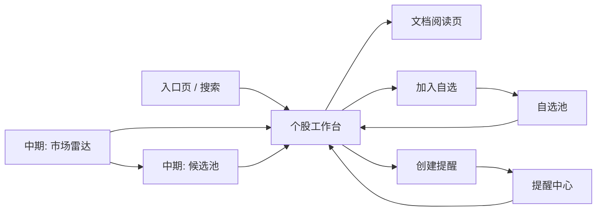
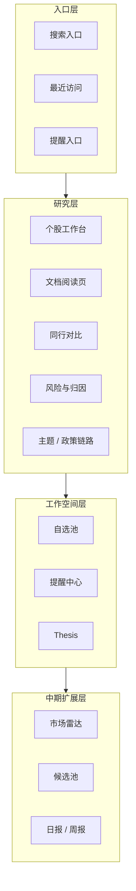
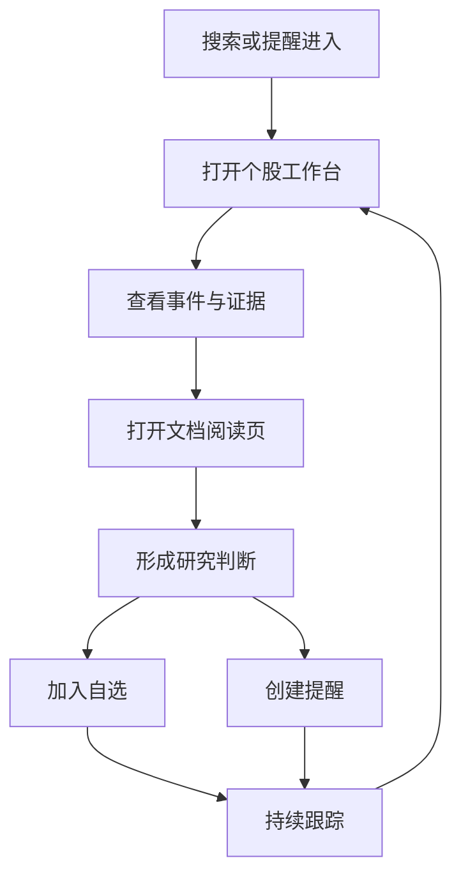
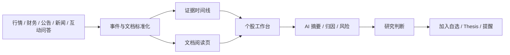
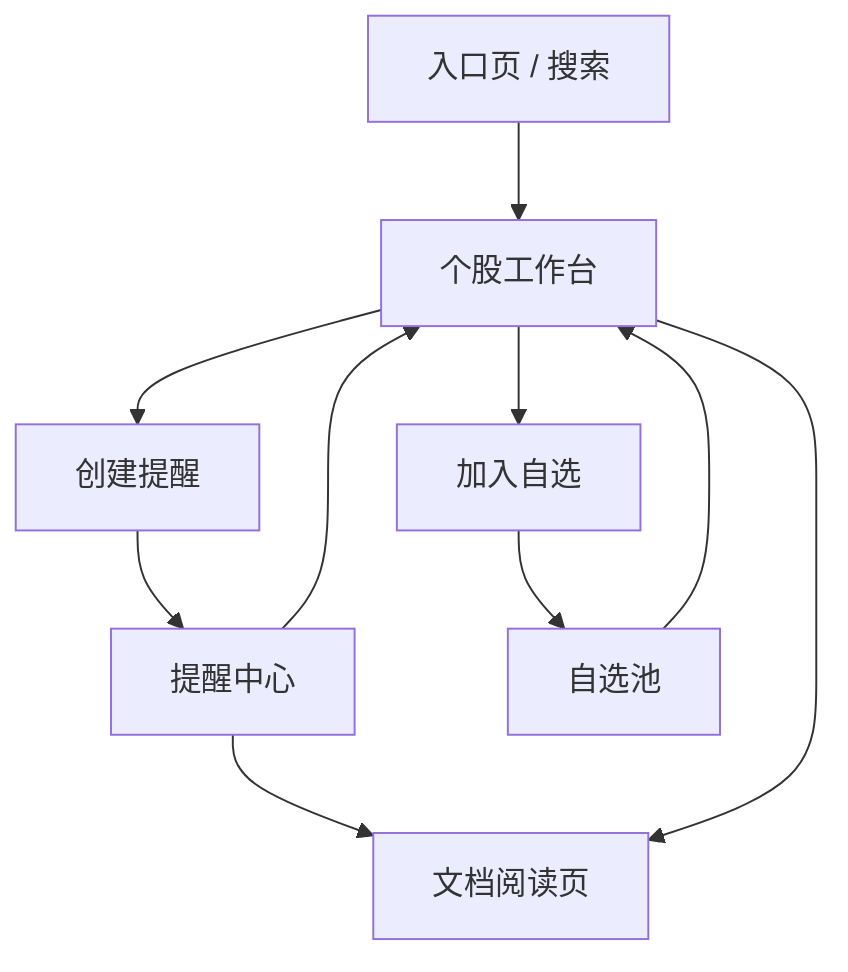

# Alpha Sight 产品 PRD

## 1. 文档信息

- 产品名称：`Alpha Sight`
- 文档类型：`PRD`
- 当前阶段：`V1 / 中型系统规划`
- 文档版本：`v0.2`
- 更新时间：`2026-04-09`

## 2. 一句话定义

Alpha Sight 是一个面向 A 股中重度研究场景、**以个人使用为核心前提** 的证据链式 AI 投研工作台。  
它不做自动交易，不做黑盒荐股，而是把 `行情 + 财务 + 公告 + 新闻 + 互动问答 + 研究结论 + 跟踪提醒` 组织成可追溯、可比较、可持续跟踪的研究工作流。

## 3. 战略判断

### 3.1 这个产品为什么值得做

A 股研究的真实问题不是“没有信息”，而是：

- 信息太多，来源太散
- 事件和价格之间的关系难以快速梳理
- 公告、问答、新闻、财报经常需要重复阅读
- 很多观点形成后没有被系统化保存和跟踪

AI 在这个场景里的价值，不是“预测股价”，而是：

- 压缩信息摄入时间
- 建立证据链
- 结构化提炼研究结论
- 降低持续跟踪成本

### 3.2 我们不做什么

明确排除以下方向：

- 自动交易
- 下单执行
- 黑盒式“明天买哪只”
- 娱乐化荐股内容流
- 一开始就做 Wind / Bloomberg 全量替代品

### 3.3 我们真正卖的是什么

不是“AI 很聪明”，而是：

1. `研究速度`
2. `证据可信度`
3. `信息组织能力`
4. `持续跟踪能力`

## 4. 行业对标与产品结论

本节不是简单列竞品，而是提炼“这些头部产品为什么强，以及我们该学什么、不该学什么”。

### 4.1 Bloomberg Terminal

Bloomberg 的强项不是某个单点 AI 功能，而是 `数据 + 新闻 + 研究 + 图表 + 监控 + 工作流` 一体化。  
官方页面强调其 Research、News、Charts、Launchpad、Alerts 等能力是统一工作流的一部分；`2024-01-22` 上线 AI Earnings Call Summaries，`2025-01-15` 上线 AI News Summaries，都不是孤立工具，而是嵌入原有研究流程中。

可借鉴点：

- `AI 必须嵌入原有研究动作，而不是独立悬浮`
- `研究、图表、消息、提醒必须能串成一条路径`
- `个股分析不应只有数据页，还应有新闻与研究上下文`

不该照搬的点：

- 不要在早期做全资产、全场景、全工作台
- 不要过早追求“终端感”而牺牲主路径清晰度

### 4.2 AlphaSense

AlphaSense 的核心壁垒是 `高价值内容池 + 生成式搜索 + 引用验证 + 面向投资研究的交互方式`。  
官方介绍强调其生成式搜索可在数亿条高可信内容中检索，并通过引用返回结果；帮助中心进一步强调可限定文档、公司、watchlist、行业等范围，并在答案中整合结构化财务与非结构化内容。

可借鉴点：

- `AI 回答必须带引用`
- `查询范围必须可控`
- `公司 / 行业 / watchlist 是研究天然作用域`
- `生成式搜索不能脱离优质内容池`

不该照搬的点：

- 我们前期不应该把产品主入口做成聊天框
- A 股场景里，文本内容池不可能一开始达到 AlphaSense 的覆盖广度

### 4.3 Fiscal.ai / FinChat

Fiscal.ai（原 FinChat）代表的是 `现代化基本面研究终端`：全球财务数据、KPI、分部数据、IR 内容、Dashboard、Notifications、AI summaries 整合在一个较轻量的终端里。  
它的强项是把“公司页”做成一个高频研究入口，而不是把每种能力拆成很重的独立模块。

可借鉴点：

- `公司页 / 个股页必须成为研究主入口`
- `KPI、分部、IR 内容应该和财务数字在一个视图里`
- `看板、自选、提醒要围绕研究对象而不是围绕功能分类`

不该照搬的点：

- 我们不应一开始走“全球基本面终端”路线
- A 股第一阶段更需要的是公告、问答、事件链，而不是 KPI 数据极致丰富

### 4.4 Koyfin

Koyfin 的亮点是 `筛选器 + Dashboard + Alerts + Company Snapshot`。  
其官方页面明确强调：Screener 支持 `100,000+` 全球股票和 `5,900+` 筛选条件；Alerts 支持价格、估值、技术、新闻、文档，且可直接对 watchlists / portfolios 批量设置，并可在 chart、snapshot、table 等上下文中原地创建。

可借鉴点：

- `选股器必须支持保存、复用、导出、加入 watchlist`
- `提醒不应孤立存在，应该在图表、表格、股票页里原地创建`
- `提醒中心必须是一个可筛选、可管理的 hub`

不该照搬的点：

- 早期不追求超多筛选条件数量
- 不追求全球市场广覆盖

### 4.5 TradingView

TradingView 的核心价值在于 `图表 + 筛选 + 服务端提醒引擎 + 多设备触达`。  
官方帮助文档显示，其 alerts 支持 price、technical、watchlist、webhook 等多种形式，watchlist alerts 能对整个列表批量生效，并在 Web、桌面、移动端工作。

可借鉴点：

- `提醒必须是服务端计算，不依赖用户在线`
- `同一规则可批量作用于 watchlist`
- `提醒对象不仅是价格，也包括技术条件和组合条件`
- `提醒管理页要支持搜索、排序、状态管理`

不该照搬的点：

- 我们不是图表交易平台，不要把资源过多投入到重度技术分析工具链
- Pine Script 式策略生态不是短期目标

### 4.6 Quartr

Quartr 的价值在于 `第一方 IR 材料 + 实时转写 + 可被 LLM 消化的结构化高质量文本`。  
官方页面强调其实时 audio/transcript、filings、slides、event summaries、精确时间戳与说话人识别，并明确面向 AI search engines 和 research platforms。

可借鉴点：

- `第一方资料的权威性远高于二手摘要`
- `文档必须支持段落级 / 页面级可追溯`
- `事件摘要应绑定整套相关材料，而不是只绑定一篇文档`

不该照搬的点：

- 我们前期不需要做“全球实时财报电话会平台”
- 但应提前为“事件 -> 多文档包”预留产品结构

### 4.7 Wind / iFinD / ChoiceAI

中国本土投研终端真正强的地方不是“界面像终端”，而是：

- A 股 / 宏观 / 行业 /公告 / 研报 / 资讯的数据深度
- 中国市场特有研究工作流的适配
- 产业链、事件库、知识图谱、AI 搜索、AI 总结的本地化能力

官方公开信息体现出的关键点包括：

- Wind WFT 强在跨市场数据、资讯、研究、组合管理、宏观产业数据库
- iFinD 强调事件库、产业洞察、知识图谱、智能搜索、AI 预测、投研数据库
- ChoiceAI 强调 AI 搜索、研报总结、资讯助手、直达结果与便捷溯源

可借鉴点：

- `A 股产品必须优先解决本土数据与本土研究路径`
- `产业链与主题联动是 A 股里很重要的研究视角`
- `搜索必须带溯源`
- `研报 / 公告 / 资讯 / 问答的整合是专业感的来源`

不该照搬的点：

- 不做“大而全”终端克隆
- 不在第一版就做复杂预测和回测体系

### 4.8 行业对标后的产品结论

综合上述产品，Alpha Sight 的正确产品方向应该是：

> **做 A 股个人研究者的事件驱动型研究工作台，而不是另一个行情终端。**

具体体现为：

1. `个股工作台` 是第一核心页面
2. `证据链` 是第一交互原语
3. `提醒` 是第一留存机制
4. `候选池` 是中期扩展，而不是第一入口
5. `AI` 是研究助理，不是神谕式荐股器

### 4.9 能力对标矩阵

| 能力 | Bloomberg | AlphaSense | Koyfin / TradingView | Quartr | Wind / iFinD / ChoiceAI | Alpha Sight 结论 |
|---|---|---|---|---|---|---|
| 个股研究主入口 | 强 | 中 | 中 | 中 | 强 | 必做，作为第一核心页面 |
| 新闻 / 文档 / 研究整合 | 强 | 很强 | 中 | 强 | 强 | 必做，且要支持证据回跳 |
| 生成式 AI 搜索 | 中 | 很强 | 弱 | 中 | 中 | 做，但不能做成第一入口 |
| 图表与技术分析 | 强 | 弱 | 很强 | 弱 | 中 | 做基础层，不作为第一壁垒 |
| 筛选器 | 中 | 中 | 很强 | 弱 | 强 | 中期重点建设 |
| 服务端提醒 | 强 | 中 | 很强 | 中 | 中 | 第一阶段必做 |
| 引用与溯源 | 中 | 很强 | 弱 | 很强 | 中 | 必做，是专业感核心 |
| 第一方 IR / 公告资料 | 中 | 中 | 弱 | 很强 | 强 | A 股必须优先做公告与问答 |
| 个人研究工作流闭环 | 强 | 强 | 中 | 中 | 强 | 长期持续强化 |

### 4.10 对标后的产品取舍

`必须吸收`

- AlphaSense 的引用式生成
- Bloomberg 的工作流整合
- Koyfin / TradingView 的提醒能力
- Quartr 的文档级溯源
- Wind / iFinD / ChoiceAI 的 A 股本土研究路径

`刻意不做`

- 早期做大而全首页
- 早期做重度技术分析生态
- 早期做共享与协同机制
- 早期做黑盒预测与自动化投资决策

## 5. 用户与使用场景

### 5.1 目标用户分层

#### 核心用户 A：中重度个人投资者

特征：

- 每天看盘或盘后复盘
- 有一定基本面、技术面和事件面研究能力
- 经常在多个网站和终端之间切换
- 愿意为效率和专业体验付费

核心诉求：

- 快速理解一只股票为什么动
- 快速读完公告 / 问答 / 财报
- 建立稳定的自选与提醒工作流

#### 核心用户 B：独立研究者 / 内容创作者

特征：

- 需要覆盖一批股票或主题
- 高频输出结构化观点
- 对资料检索、总结和主题跟踪依赖高

核心诉求：

- 批量发现题材与事件
- 快速形成框架化结论
- 累积研究资产

### 5.2 初期不重点服务的用户

- 高频交易者
- 完全被动投资用户
- 只想要一句“买哪只”的用户
- 团队协作型用户
- 要求完整替代机构终端的超重度机构客户

### 5.3 典型使用场景

#### 场景 1：盘后快速复盘

用户打开一只股票，希望在 1 到 3 分钟内搞清楚：

- 今天为什么涨跌
- 最近 7 到 30 天发生了什么
- 有哪些高信号公告 / 问答 / 新闻
- 风险有没有变化

#### 场景 2：读公告 / 财报

用户打开一篇公告或财报，希望系统帮助完成：

- 摘要
- 风险提取
- 关键句定位
- 对公司或同行的影响判断

#### 场景 3：跟踪 thesis

用户已经关注一只股票，希望系统在 thesis 关键条件变化时提醒，而不是自己每天重复翻资料。

#### 场景 4：构建候选池

用户希望从全市场中筛出一批值得进一步研究的股票，但不想直接接受黑盒买入推荐。

#### 场景 5：自选池晨间检查

用户打开自选池，希望系统优先回答：

- 今天哪些股票出现了高优先级变化
- 哪些变化与已有 thesis 直接相关
- 哪些提醒值得优先处理
- 今天应该先点开哪几只股票

#### 场景 6：主题 / 政策链路跟踪

用户关注某个主题、政策或产业链方向，希望系统帮助完成：

- 识别主题核心股票与边缘股票
- 汇总政策、产业、公司事件之间的传导关系
- 区分主题扩散与个股独立催化
- 跟踪主题强度与关键证据变化

## 6. 产品目标

### 6.1 业务目标

1. 建立单票研究与事件跟踪的专业口碑
2. 把用户的自选池、提醒、thesis 沉淀成高粘性资产
3. 在中期扩展到全市场发现与候选池
4. 把产品打磨成个人研究者可长期使用的研究工作台

### 6.2 用户目标

1. 在 `1 到 3 分钟` 内看懂一只股票最近的关键变化
2. 在一个系统里完成“看证据、看文档、做判断、设提醒”
3. 显著降低手工阅读公告与盘后复盘成本
4. 让研究路径可重复、可回看、可持续跟踪

### 6.3 北极星目标

建立“有效研究会话”。

定义：

- 打开个股页
- 查看至少一个事件或文档
- 执行至少一个研究动作：加入自选 / 保存 thesis / 创建提醒

## 7. 产品边界

### 7.1 我们做什么

- 个股研究
- 文档智能阅读
- 事件驱动分析
- thesis 研究管理
- 自选跟踪
- 提醒与监控
- 主题 / 政策 / 产业链研究
- AI 辅助选股
- 市场雷达与候选池

### 7.2 我们不做什么

- 自动交易
- 直接买卖执行
- 黑盒“推荐买入”
- 以社区内容流作为产品主线
- 团队协作、共享研究对象、评论审批流
- 一开始做全球多资产大终端

## 8. 阶段规划

## 8.1 第一阶段：V1 核心研究系统

时间范围：`0 到 4 个月`

目标：

- 把单票研究、文档阅读、thesis、watchlist intelligence、提醒闭环做成日常高频工具
- 建立“研究对象 -> 证据 -> 判断 -> 跟踪”的稳定产品心智

交付：

- 全局搜索 / 入口页
- 个股工作台
- 文档阅读页
- 自选池（含 watchlist intelligence）
- 提醒中心
- thesis 研究对象
- 事件模型基础层
- 基础主题 / 政策映射

## 8.2 第二阶段：V2 批量覆盖与主题系统

时间范围：`4 到 10 个月`

目标：

- 从“研究一只票”扩展到“研究一组股票、一条主题和一段政策链路”
- 让独立研究者和高频研究用户可以做批量覆盖与持续跟踪

交付：

- 市场雷达
- 结构化选股器
- 候选池解释卡
- thesis 版本历史
- 主题 / 政策 / 产业链工作台
- 催化剂日历
- 日报 / 周报
- 更完整的同行 / 产业链对比
- 自然语言选股

## 8.3 第三阶段：V3 个人 AI 投研操作系统

时间范围：`10 到 18 个月`

目标：

- 从基础研究工具演进为成熟的个人 AI 投研操作系统

交付：

- 工作流自动化
- API / webhook
- 个性化研究记忆
- 更强的研究知识库
- 更强的自然语言研究与发现能力
- 更深的数据覆盖与自动化能力

## 8.4 按中型系统推进的 P0 / P1 / P2 能力重排

如果目标不是“最小可用 MVP”，而是“做一个真正有持续使用价值的中型系统”，那么优先级不应只按实现难度排，而应按 `高频性、信任感、复利性` 排。

`P0`

- 个股工作台
- 文档阅读页
- 自选池 / watchlist intelligence
- 提醒中心
- thesis 研究对象
- 事件模型与证据时间线
- 全局搜索 / 研究入口

这些能力决定用户会不会每天打开、会不会在系统内形成研究闭环、会不会把研究资产沉淀下来。

`P1`

- 主题 / 政策 / 产业链工作台
- 同行 / 产业链对比
- 催化剂日历
- 分组研究与批量筛看
- 研究结论导出 / 日常输出辅助

这些能力决定产品是否从“单票研究工具”升级为“批量覆盖工具”和“上下文理解工具”。

`P2`

- 市场雷达
- 结构化选股器
- 自然语言选股
- 候选池
- 日报 / 周报自动生成

这些能力决定系统的覆盖面和成长性，但如果 `P0` 做不深、`P1` 做不透，`P2` 往往只会增加噪音，而不会增加真实价值。

## 9. 产品形态与信息架构

### 9.1 产品形态总览

从产品形态上看，Alpha Sight 不是一个“首页信息大杂烩”，而是一个围绕研究对象逐层下钻的个人工作台。

核心结构如下：



这个结构表达的是：

- `入口页` 负责进入研究对象
- `个股工作台` 是第一核心页面
- `文档阅读页` 承接深度证据阅读
- `自选池` 和 `提醒中心` 承接持续跟踪
- `市场雷达 / 候选池` 不是第一入口，但属于中型系统的重要第二层能力

### 9.2 产品架构视图

从产品视角看，系统可以分成四层：



### 9.3 核心页面形态草图

为了避免“只有文字没有形态”，下面用低保真草图描述个股工作台的目标布局。

```text
+--------------------------------------------------------------------------------------------------+
| 顶部摘要区                                                                                        |
| 股票名称 / 代码 / 行业 | 价格 / 涨跌 / 换手 / 估值 | 今日一句话 AI 摘要                           |
+-------------------------------------------+--------------------------------+---------------------+
| 左侧：证据与事件区                         | 中部：数据与比较区             | 右侧：研究动作区    |
| - 证据时间线                               | - 财务指标概览                 | - 风险卡            |
| - 公告卡                                   | - 估值概览                     | - Thesis 状态       |
| - 新闻卡                                   | - 资金面概览                   | - Thesis 证实/证伪  |
| - 互动问答卡                               | - 同行对比概览                 | - 加入自选          |
| - 财务披露卡                               | - 主题/政策/产业链联动         | - 创建提醒          |
|                                           |                                | - 快捷记录结论      |
+-------------------------------------------+--------------------------------+---------------------+
```

这个布局的核心逻辑是：

- 左侧放“发生了什么”
- 中间放“数据怎么看”
- 右侧放“下一步做什么”

### 9.4 个人研究闭环图



这个闭环体现的是：  
Alpha Sight 的核心不是“查到一次”，而是“研究后持续跟踪，并在下一次变化时重新回到研究页”。

### 9.5 数据到研究结论流程图

这是 PRD 视角下最重要的一张流程图，用来说明产品到底怎么把数据变成可用结论。



### 9.6 中型系统核心地图

如果按中型系统推进，核心页面 / 区域应包括：

1. `全局搜索 / 入口页`
2. `个股工作台`
3. `文档阅读页`
4. `自选池 / Watchlist Intelligence`
5. `提醒中心`
6. `Thesis 研究区`
7. `主题 / 政策 / 产业链工作台`
8. `市场雷达 / 候选池`

这些页面 / 区域不是同优先级并行开发，而是围绕 `P0 -> P1 -> P2` 逐层展开。

### 9.7 设计原则

- AI 不单独做成聊天首页
- 个股工作台是绝对核心页
- 文档阅读页是个股页的下钻页
- 自选池和提醒中心负责沉淀与跟踪

### 9.8 页面优先级

`P0`

- 全局搜索 / 入口页
- 个股工作台
- 文档阅读页
- 自选池 / Watchlist Intelligence
- 提醒中心
- Thesis 研究区

`P1`

- 主题 / 政策 / 产业链工作台
- 同行 / 产业链对比视图
- 催化剂日历
- 研究输出辅助

`P2`

- 市场雷达
- 结构化选股器
- 候选池
- 日报 / 周报

### 9.9 优先级判断原则

- `P0` 决定用户是否愿意把研究动作迁移到系统里
- `P1` 决定用户是否把系统当成长期依赖的研究工作台
- `P2` 决定系统是否具备更强的覆盖面、发现能力和增长空间
- 任何 `P2` 能力都不应以削弱 `P0` 的可解释性和可追溯性为代价

## 10. 页面与核心交互对象 PRD

## 10.1 全局搜索 / 入口页

### 页面目标

帮助用户最快进入研究对象，而不是展示“热闹首页”。

### 核心任务

- 搜股票代码 / 名称
- 看最近访问对象
- 看未读提醒
- 快速回到最近研究路径

### 页面模块

1. `全局搜索框`
2. `最近访问`
3. `最近提醒`
4. `最近研究对象`

### 验收标准

- 股票搜索支持代码、简称、全称联想
- 搜索结果点击后直接进入个股工作台
- 最近访问与最近提醒必须可直接跳转

## 10.2 个股工作台

### 页面目标

让用户在一个页面中完成单票研究闭环。

### 页面核心问题

用户进入页面后，系统必须回答：

1. 这只股票今天为什么动了？
2. 最近发生了什么实质变化？
3. 当前有哪些关键风险？
4. 接下来我该盯什么？

### 页面结构

#### A. 顶部摘要区

- 股票名称 / 代码 / 行业
- 价格、涨跌、成交、换手等行情摘要
- 估值摘要
- 今日一句话 AI 摘要

#### B. 证据与事件区

- 证据时间线
- 关键公告卡
- 新闻卡
- 互动问答卡
- 财务披露卡

#### C. 数据与比较区

- 财务指标概览
- 估值概览
- 资金面概览
- 同行对比概览
- 主题 / 政策 / 产业链联动概览

#### D. 研究动作区

- 风险卡
- thesis 状态卡
- thesis 证实 / 证伪信号
- 加入自选
- 创建提醒
- 快捷记录结论

### 功能列表

- 查看核心指标
- 查看最近关键事件时间线
- AI 生成今日摘要
- AI 生成最近变化总结
- AI 生成归因卡
- AI 生成风险提示
- 查看同行对比
- 查看主题 / 政策 / 产业链联动
- 查看归因候选及证据权重
- 查看 thesis 证实 / 证伪信号
- 一键加入自选
- 一键创建提醒
- 一键保存 thesis
- 更新 thesis 状态与复核时间

### 设计要求

- 首屏必须先呈现事实数据，再加载 AI 摘要
- AI 归因必须区分“事实”和“推断”
- “今天为什么动了”必须输出为候选驱动因素排序，不允许伪确定性归因
- 归因必须区分个股因素、行业 / 主题因素、政策 / 监管因素、市场共振因素
- 时间线必须支持按来源过滤：公告 / 新闻 / 问答 / 财务 / 价格信号
- 主题 / 政策联动必须区分直接关联与间接受益
- thesis 卡必须展示当前状态、上次更新时间、下一次复核点
- 右侧研究动作区必须常驻，不应埋得过深

### 验收标准

- 首屏基础数据渲染：`<= 3 秒`
- AI 摘要必须带引用
- 证据时间线支持过滤与排序
- 用户能区分事实、推断和待验证信号
- 用户能快速判断当前变化更偏个股驱动还是主题 / 政策驱动
- 用户可在当前页直接完成“加入自选”和“设置提醒”

## 10.3 文档阅读页

### 页面目标

把“读公告 / 财报 / 问答 / 新闻”从手工阅读变成 AI 增强阅读。

### 页面模块

1. `文档头部`
   - 标题、来源、发布时间、股票关联
2. `AI 摘要卡`
3. `关键句 / 证据片段`
4. `风险提取`
5. `原文区`
6. `当前文档问答区`

### 功能列表

- 文档摘要
- 风险提取
- 关键句高亮
- 事件标签抽取
- 基于当前文档的问答
- 从答案跳回原文段落

### 设计要求

- 问答默认只基于当前文档
- 关键结论必须可回跳到原文
- 对公告、财报、问答、新闻可复用统一阅读框架

### 验收标准

- 每个摘要都能追溯到对应原文
- 问答不允许无引用扩写
- 风险与反证要和正文关联

## 10.4 自选池

### 页面目标

把“我长期关注什么”与“今天谁需要先看”组织成系统化管理。

### 页面模块

1. `分组导航`
2. `Watchlist Intelligence 总览`
3. `自选列表`
4. `thesis 命中 / 风险摘要`
5. `提醒状态`
6. `关联主题 / 政策标签`

### 核心字段

- 股票名称 / 代码
- 分组
- 今日优先级
- 最近关键事件
- thesis 命中状态
- thesis 风险状态
- 关联主题 / 政策
- 最近更新时间
- 未读提醒数

### 功能列表

- 新建分组
- 添加 / 移除股票
- 打标签
- 按变化强度 / 提醒级别 / thesis 风险排序
- 展示最近关键变化
- 展示提醒状态
- 展示 thesis 命中与证伪信号
- 展示关联主题 / 政策联动
- 生成今日优先处理清单

### 设计要求

- 自选池不是静态列表，而是每日研究入口
- 默认排序应优先反映研究优先级，而不是字母或添加时间
- 必须能够一眼看出哪些股票需要立即复核 thesis
- 批量覆盖场景下，必须支持快速筛出“今天值得先看”的 `5 到 10` 只股票

### 验收标准

- 用户能快速识别“哪些股票今天发生了变化”
- 用户能快速识别“哪些 thesis 需要复核”
- 支持从自选项一跳进入个股工作台

## 10.5 提醒中心

### 页面目标

从“被动查询”升级为“主动跟踪”。

### 提醒类型

- 价格突破提醒
- 成交量异动提醒
- 公告提醒
- 财报窗口提醒
- 关键词提醒
- 互动问答提醒
- thesis 证实提醒
- thesis 证伪提醒
- 主题 / 政策扩散提醒

### 页面模块

1. `提醒筛选栏`
2. `提醒列表`
3. `提醒详情抽屉`
4. `影响判断说明`

### 功能列表

- 创建提醒规则
- 查看提醒历史
- 标记已读
- 编辑 / 暂停提醒
- 从提醒直接更新 thesis 状态
- 跳转股票 / 文档详情

### 设计要求

- 提醒规则应支持在个股页原地创建
- 提醒列表必须支持搜索、筛选、排序
- 提醒详情必须说明它影响哪条 thesis 或哪条跟踪假设
- 提醒需区分信号级别：观察 / 重要 / 关键
- 提醒详情必须能落回具体证据

### 验收标准

- 提醒必须能落到具体股票、来源与 thesis
- 用户可从提醒直接返回证据并更新研究判断
- 支持按股票、时间、类型、状态过滤

## 10.6 Thesis 研究对象定义

### 对象目标

让研究结论从一次性笔记变成可持续维护的研究资产。

### 核心字段

- thesis 标题 / 一句话判断
- 研究结论正文
- 支撑证据
- 关键催化剂
- 关键验证指标
- 证伪条件
- 观察窗口
- 当前状态：观察中 / 验证中 / 部分证实 / 部分证伪 / 失效
- 最近更新时间
- 版本历史

### 核心动作

- 新建 thesis
- 从个股页或文档页摘取证据生成 thesis 草稿
- 手动编辑 / AI 辅助重写
- 关联事件、文档、提醒
- 更新状态与下一次复核时间
- 查看版本历史

### 设计要求

- thesis 不能只是自由文本笔记，必须至少包含判断、证据、验证条件、证伪条件
- 同一只股票允许存在多条 thesis
- thesis 的任何状态变化都必须附带时间与依据
- 提醒与自选变化要能回写到 thesis

### 验收标准

- 用户能清楚回答“我为什么看这只票、靠什么验证、什么情况下我会否定它”
- 用户能回看 thesis 如何随着事件与证据演进而变化

## 10.7 主题 / 概念 / 政策链路

### 能力目标

让产品不仅能研究个股，还能研究个股所处的主题、政策和产业链上下文。

### 核心对象

- 主题 / 概念
- 政策 / 监管文件
- 产业链节点
- 核心股票 / 跟随股票 / 边缘股票
- 主题强度变化

### 核心能力

- 从股票反查关联主题 / 政策 / 产业链
- 从主题查看代表股票与联动强度
- 把政策、行业事件、公司事件串成传导链
- 区分长期产业逻辑与短期题材扩散
- 记录主题阶段：启动 / 扩散 / 分化 / 退潮

### 设计要求

- 主题 / 概念不能只做静态标签，必须有时间维度和证据来源
- 政策链路必须标注原始文件与发布时间
- 个股工作台必须能解释“这是公司自身变化，还是主题 / 政策驱动”
- 同一只股票可同时属于多个主题，但需要区分主线与次线

### 验收标准

- 用户能快速判断某只股票当前上涨更偏公司催化还是主题扩散
- 用户能从主题进入相关股票，也能从股票回到主题链路

## 11. AI 功能规范

## 11.1 AI 在产品中的角色

AI 只做 `研究助理`，不做 `投资替代者`。

### 允许的 AI 输出

- 摘要
- 事件抽取
- 归因辅助
- 风险提取
- 同行比较辅助
- 跟踪建议
- 文档问答

### 禁止的 AI 输出

- 无证据的买卖建议
- 暗示确定性收益
- 把推断说成事实
- 不标时间和来源的判断

## 11.2 AI 输出结构

所有关键 AI 输出统一采用：

1. `结论`
2. `证据引用`
3. `时间范围`
4. `事实 / 推断标记`
5. `不确定性说明`
6. `风险 / 反证`

## 11.3 归因与反证规则

“今天为什么动了”这类问题，必须按候选驱动因素组织，而不能假装存在单一标准答案。

### 归因输出原则

- 默认输出 `1 到 3` 条候选驱动因素，而不是唯一归因
- 每条驱动因素都必须绑定证据、时间和来源
- 归因必须区分个股、行业 / 主题、政策 / 监管、市场共振四类
- 证据不足时必须明确返回“证据不足，暂不下结论”
- 归因结果必须同时呈现支持证据与反证

### 反证要求

- 如果存在与主结论冲突的公告、新闻、问答或财务信号，必须显式展示
- 风险与反证不是页面附属物，而是主结论的一部分
- 用户应能从反证直接跳转回原文与事件

## 11.4 AI 选股定位

AI 选股属于中期能力，正确角色是：

- 候选发现
- 多维排序
- 入选原因解释
- 风险提示
- 后续跟踪建议

不是：

- 直接推荐买入
- 代替用户判断
- 做收益承诺

## 12. 数据需求

### 12.1 第一阶段必须具备

- A 股证券主数据
- 日线行情
- 每日基本指标
- 财务报表
- 财务指标
- 公司公告
- 投资者互动问答
- 基础新闻
- 行业分类
- 基础资金面信号
- 事件主表与事件标签体系
- 主题 / 概念基础映射

### 12.2 如果按中型系统推进，必须前置补齐

- 政策与产业文档
- 主题 / 概念映射增强层
- 产业链与同行关系映射
- 监管与资本运作事件
- thesis 结构化存储与版本历史
- 催化剂日历

### 12.3 中期建议补充

- 券商研报
- 机构调研数据
- 北向 / 两融 / 大宗等数据
- 主题与概念映射
- 政策与产业文档

### 12.4 长期可扩展

- 更高质量企业级数据源
- 电话会纪要
- 国际市场
- 行业数据库

### 12.5 事件模型补充需求

事件不是标签，而是本产品最关键的研究对象之一。

#### 事件类型

- 公司经营事件
- 财务披露事件
- 资本运作事件
- 监管与合规事件
- 行业 / 政策事件
- 价格 / 成交异动事件

#### 事件必须记录的信息

- 事件标题
- 事件类型
- 发生时间与披露时间
- 关联股票
- 关联文档
- 关联主题 / 政策
- 来源可信度
- 重要度等级
- 与价格变化的关系：已验证 / 待验证 / 仅时间重合

#### 建模原则

- 同一个事件可绑定多篇文档，形成“事件包”
- 同一篇文档也可以支持多个事件
- 个股页时间线展示的不是文档堆积，而是事件组织后的研究线索
- 价格变化只能与事件建立候选关系，不能默认当作确定因果

### 12.6 研究资产补充需求

- WatchlistItem 需要记录研究优先级、分组、标签、最后复核时间
- Alert 需要能够绑定股票、事件、文档、thesis 中的至少一类对象
- Thesis 需要支持版本历史、状态迁移、证据回链
- 主题 / 政策对象需要支持与股票、自选、提醒的双向关联

## 13. 关键用户流程

## 13.1 单票研究主流程

1. 用户搜索股票
2. 进入个股工作台
3. 查看今日摘要与证据时间线
4. 点开重要公告 / 新闻 / 问答
5. 阅读 AI 摘要与原文
6. 做出判断或更新 thesis
7. 加入自选或设置提醒

## 13.2 自选跟踪流程

1. 用户把股票加入自选
2. 系统记录分组、标签与当前 thesis
3. 系统按变化强度与 thesis 风险生成优先级
4. 新事件或 thesis 条件变化触发提醒
5. 用户从自选池或提醒进入个股工作台
6. 更新 thesis 或移除观察

## 13.3 主题 / 政策跟踪流程

1. 用户关注一个主题、概念或政策方向
2. 系统汇总政策文件、行业事件、相关公司事件
3. 系统识别核心股票、跟随股票与边缘股票
4. 用户从主题链路进入个股工作台深挖
5. 新政策或主题强度变化触发提醒
6. 用户更新自选和 thesis

## 13.4 页面关系



## 14. 指标体系

## 14.1 北极星指标

- `每周有效研究会话数`

## 14.2 核心过程指标

- DAU / WAU
- 单用户自选股票数
- 单用户提醒规则数
- 单用户保存 thesis 数
- thesis 更新率
- 个股页停留时长
- 自选池 intelligence 打开率
- 文档摘要使用率
- AI 引用点击率
- 提醒点击率
- 提醒到研究动作转化率
- 提醒到 thesis 更新转化率
- 主题 / 政策链路点击率

## 15. 非功能要求

### 15.1 性能

- 首屏基础数据：`<= 3 秒`
- 普通搜索响应：`<= 1 秒`
- 已缓存 AI 摘要：`<= 1 秒`
- 新生成 AI 摘要：`<= 10 秒`

### 15.2 可追溯性

- AI 输出必须可回到原始证据
- 所有提醒、摘要、结论保留时间戳

### 15.3 可用性

- 桌面端优先
- 支持深色主题
- 支持完整加载态与错误态

## 16. 风险与规避策略

### 风险 1：做成大而全但不够深的终端

规避：

- 第一阶段先把高频研究闭环做深
- 不因为要做中型系统，就先把所有外围入口同时铺开

### 风险 2：AI 幻觉破坏专业信任

规避：

- 所有关键输出必须带引用
- 先事实后 AI
- 明确区分事实与推断

### 风险 3：提醒噪音过高

规避：

- 允许按来源和级别过滤
- 提醒规则要支持精细化配置

### 风险 4：数据源不足导致“证据链不完整”

规避：

- 公告、互动问答、新闻必须优先接入
- 从一开始按“事件 + 文档 + 证据”建模

### 风险 5：把市场噪音误写成确定性归因

规避：

- 归因必须输出候选驱动因素，而不是单一结论
- 必须同时呈现支持证据与反证
- 证据不足时要明确承认“不足以下结论”

## 17. 立项结论

V1 必须围绕以下一句话执行：

> 让用户输入一只股票后，能够在一个页面内快速获得可信、可追溯、可比较、可跟踪的研究结论。

如果 V1 做不到这一点，就不应过早扩展到复杂雷达、候选池和大终端形态。

## 18. 实施准备补充

这一部分不改变前文的产品方向，只回答一个更实际的问题：

> 基于当前 PRD 和技术架构，离真正实施还差哪些内容。

当前结论是：

- 现有文档已经足够支撑立项和技术路线统一
- 但还不够直接拉开发排期
- 缺的不是“大方向”，而是实施级规格

### 18.1 V1 需要进一步拆分

当前 `V1 / 第一阶段` 范围仍然偏大，实施前建议再切成 `M0 / M1 / M2` 三段。

`M0：工程底座与研究对象打通`

- 目标：跑通基础工程骨架和最小研究对象链路
- 交付：Monorepo、`web/api/worker` 基础结构、数据库与对象存储、本地开发编排、`Stock / Document / Event / Evidence` 最小 schema、搜索联想最小链路、个股页事实数据 mock 聚合接口、文档详情与原文回跳最小链路
- 不做：自选 intelligence、提醒引擎、thesis 状态机、主题链路深挖

`M1：单票研究闭环`

- 目标：先把“输入一只股票 -> 看懂最近变化 -> 下钻证据 -> 形成判断”做深
- 交付：全局搜索 / 入口页、个股工作台首版、文档阅读页首版、事件时间线 v1、个股 AI 摘要 v1、文档摘要与文档问答 v1、引用回跳、事实 / 推断标记
- 不做：市场雷达、候选池、自然语言选股、批量覆盖工作台

`M2：持续跟踪闭环`

- 目标：把“研究一只票”变成“持续跟踪一只票”
- 交付：自选池 / watchlist intelligence v1、提醒中心 v1、thesis 研究对象 v1、提醒规则 v1、thesis 状态流转与版本历史 v1、watchlist priority snapshot v1、从提醒回写 thesis 的链路
- 不做：主题工作台完整版、催化剂日历完整版、日报 / 周报

### 18.2 编码前必须补齐的内容

以下内容建议在编码前补到可评审状态，否则很容易边做边改：

`数据源决策`

- 需要明确每类数据的供应商 / 来源、接入方式、更新频率、历史回补范围、成本、授权边界、失败兜底策略
- 否则 schema、队列、预算和产品能力边界都不稳定

`领域模型与数据库 Schema`

- 需要把对象名落成真实表结构，包括字段、枚举、状态机、唯一键、索引、审计字段、读模型
- 重点对象包括：`Stock`、`Document`、`DocumentChunk`、`Event`、`Evidence`、`Watchlist`、`WatchlistItem`、`AlertRule`、`AlertEvent`、`Thesis`、`ThesisVersion`

`事件模型规则`

- 需要明确事件类型、事件合并规则、事件重要度、事件包生成规则、价格异动与事件的候选关联规则、来源可信度分层
- 否则个股时间线很容易退化成“文档堆积”

`API 契约`

- 需要为搜索、个股工作台、文档详情 / 文档问答、自选、提醒、thesis、最近访问补齐 request / response schema、错误码、分页筛选排序、鉴权和 SSE payload
- 否则前后端无法稳定并行

`AI 功能规格`

- 需要补齐任务类型、检索范围、过滤规则、evidence ranking、prompt 模板、citation validator、缓存 / 失效 / 重算策略、fallback 行为、模型分层和评测标准
- 否则“AI 要可追溯”只能停留在原则层

`提醒、Watchlist、Thesis 规则`

- 需要明确提醒 DSL、触发条件、冷却期、去重键、投递渠道、watchlist priority 因子、thesis 命中 / 风险 / 证伪判定条件、状态流转规则
- 这些是产品留存和差异化的核心，不适合实现时临时拍板

`测试与验收`

- 需要明确 `M0 / M1 / M2` 的验收 case、API 集成测试范围、队列任务测试范围、AI 评测方式、关键 E2E 场景、性能验收方法

### 18.3 当前最关键的三个阻塞项

如果只先补最少内容，优先补这三项：

1. `V1 -> M0 / M1 / M2` 范围切分
2. `领域模型 + API 契约`
3. `AI / 事件 / 提醒规则`

这三项不稳定，代码结构就很容易返工。

### 18.4 推荐实施顺序

建议按下面顺序推进，而不是先平铺所有页面：

1. 工程底座、数据库、对象存储、队列、本地环境
2. `Stock / Document / Event / Evidence` 基础 schema 与 ingest skeleton
3. 搜索联想、个股页事实数据聚合、文档详情
4. 文档切片、引用锚点、个股 / 文档 AI 摘要
5. 事件时间线与证据回跳
6. watchlist、thesis、alerts
7. intelligence 排序、SSE、状态回写

### 18.5 这一版 PRD 的实施结论

在当前版本下，可以认为：

- `能立项`
- `能定技术方向`
- `能开始拆开发任务`
- `但还不适合直接全面开工`

进入实施前，至少应先锁定：

- `M0 / M1 / M2` 范围
- 数据源方案
- 核心 schema
- API 契约
- AI / 事件 / 提醒规则

## 19. 参考产品与公开资料

- Bloomberg Terminal 总览：https://professional.bloomberg.com/products/bloomberg-terminal/
- Bloomberg AI Earnings Call Summaries： https://www.bloomberg.com/company/press/bloomberg-launches-ai-powered-earnings-call-summaries/
- Bloomberg AI News Summaries： https://www.bloomberg.com/company/press/bloomberg-launches-gen-ai-summarization-for-news-content/
- AlphaSense Financial Services： https://www.alpha-sense.com/solutions/financial-services
- AlphaSense Smart Summaries： https://www.alpha-sense.com/platform/smart-summaries
- AlphaSense Generative Search Help： https://help.alpha-sense.com/hc/en-us/articles/41665816407699
- Koyfin Screener： https://www.koyfin.com/features/stock-screener/
- Koyfin Alerts： https://www.koyfin.com/features/alerts/
- Fiscal.ai Terminal： https://fiscal.ai/
- Fiscal.ai APIs： https://finchat.io/enterprise/
- TradingView Stock Screener： https://www.tradingview.com/support/solutions/43000718866-what-is-the-stock-screener/
- TradingView Alerts： https://www.tradingview.com/support/solutions/43000520149-introduction-to-tradingview-alerts/
- TradingView Watchlist Alerts： https://www.tradingview.com/support/solutions/43000739708-watchlist-alerts-your-trading-edge/
- Quartr API： https://quartr.com/products/quartr-api
- Quartr AI Chat： https://quartr.com/pages/features/ai-chat
- Wind WFT： https://www.wind.com.cn/portal/en/WFT/index.html
- iFinD： https://aifind.com/
- ChoiceAI： https://choice.eastmoney.com/school
