# Alpha Sight 技术架构设计

## 1. 文档信息

- 项目：`Alpha Sight`
- 文档类型：`技术架构设计`
- 版本：`v0.2`
- 更新时间：`2026-04-08`

## 2. 技术目标

技术方案必须服务以下产品目标：

1. `个股工作台首屏快`
2. `AI 输出必须可追溯`
3. `文档和事件可持续增量接入`
4. `提醒必须服务端稳定触发`
5. `系统可从 MVP 平滑扩展到市场雷达与候选池`
6. `系统默认只服务个人工作空间，不为协作而预埋复杂度`

这意味着架构不能只围绕“页面渲染”设计，而必须同时考虑：

- 数据接入与标准化
- 文档解析与检索
- 事件建模
- AI 证据化生成
- 用户工作空间
- 服务端提醒引擎

## 3. 技术栈结论

### 3.1 前端

- 框架：`Next.js`（App Router）
- 语言：`TypeScript`
- 样式：`Tailwind CSS`
- 通用组件：`shadcn/ui + Radix UI`
- 状态管理：`Zustand`
- 远程数据：`TanStack Query`
- 图标：`Lucide`

### 3.2 后端

- 框架：`NestJS`
- 语言：`TypeScript`
- API 风格：`REST + SSE / WebSocket`
- 调度与异步任务：`BullMQ + Redis`
- 鉴权：`JWT`

### 3.3 AI 侧

- 编排框架：`LangGraph`
- 推荐语言：`Python`
- 服务形态：`独立 AI Orchestrator`
- LLM 层：统一 Provider 抽象
- Embedding：统一向量化抽象

### 3.4 数据层

- 主数据库：`PostgreSQL`
- 向量检索：`pgvector`
- 缓存 / 队列：`Redis`
- 全文检索：`OpenSearch`
- 对象存储：`S3 / MinIO`
- 大规模时序 / 排名计算：`ClickHouse`（中期引入）

### 3.5 工程组织

- 代码仓：`Monorepo`
- JS 包管理：`pnpm workspace`
- 任务编排：`Turborepo`
- Python 包管理：`uv`

## 4. 行业对标对架构的影响

技术方案不是凭空选出来的，它必须反映产品对标后的结论。

### 4.1 从 Bloomberg 学到的

- 页面只是表现层，真正价值在统一研究工作流
- 因此需要 `业务 API 聚合层`，而不是前端直接拼多个底层数据源

### 4.2 从 AlphaSense 学到的

- AI 必须基于优质内容池和引用校验
- 因此需要 `检索层 + 证据层 + 引用校验层`

### 4.3 从 Koyfin / TradingView 学到的

- Alerts 不是页面功能，而是服务端能力
- 因此提醒要单独做 `规则存储 + 服务端计算 + 投递`

### 4.4 从 Quartr 学到的

- 文档不是附件，而是研究主对象
- 因此需要 `文档解析、切片、索引、引用定位`

### 4.5 从 Wind / iFinD / ChoiceAI 学到的

- A 股产品必须优先处理本土数据源和事件体系
- 因此需要 `数据源适配层 + 实体标准化 + 事件抽取`

## 5. 总体架构原则

1. `业务服务与 AI 服务分离`
2. `先模块化单体，后按职责拆分`
3. `先事实数据，后 AI 派生数据`
4. `先事件与证据建模，后做复杂分析`
5. `所有关键链路都可观测`
6. `优先支持个人工作空间，不提前引入协作复杂度`

## 6. 系统上下文图

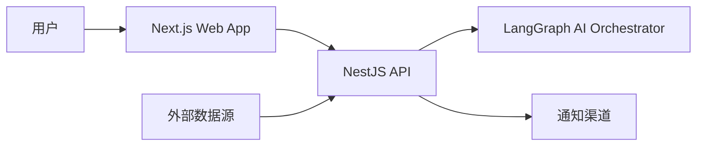

## 7. 容器级架构图

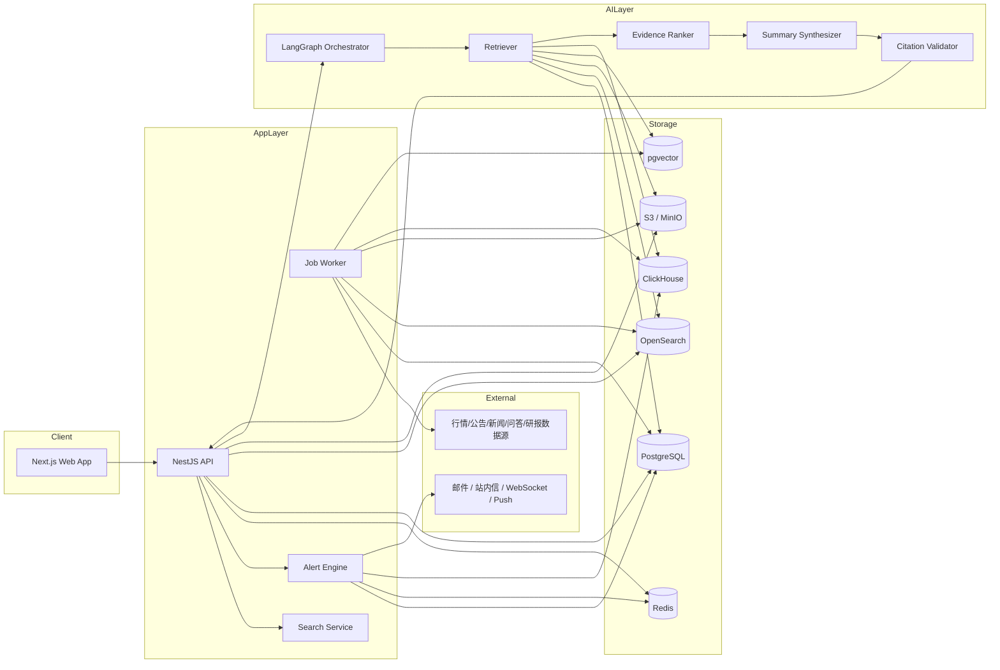

### 7.1 在线读路径与离线写路径

这张图用来明确系统最核心的两条主链路：

- `离线写路径`：把外部数据变成可服务的研究对象
- `在线读路径`：把事实数据和 AI 结果组合后返回给用户

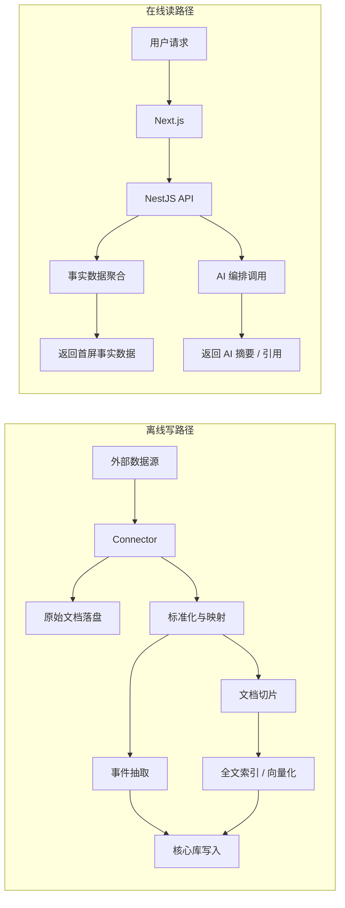

## 8. 服务职责划分

## 8.1 Next.js Web App

职责：

- 页面路由与布局
- SSR / RSC 首屏渲染
- 客户端交互状态
- 表格、图表、证据卡片等渲染
- SSE / WebSocket 接收提醒与长任务状态

不负责：

- 直接访问底层数据源
- 直接调用模型和向量库

## 8.2 NestJS API

职责：

- 统一业务 API
- 用户与基础鉴权
- 聚合个股页 / 自选 / 提醒等页面数据
- 管理异步任务
- 对接 AI Orchestrator
- 审计与操作日志

不负责：

- 复杂 LangGraph 状态机
- 大规模文档切片和向量化

## 8.3 Job Worker

职责：

- 采集外部数据
- 做标准化、清洗、入库
- 文档解析与索引
- 事件抽取
- embedding 生成

## 8.4 Alert Engine

职责：

- 管理提醒规则
- 周期或事件驱动执行规则计算
- 生成提醒事件
- 投递到站内信 / WebSocket / 邮件

## 8.5 LangGraph AI Orchestrator

职责：

- 个股摘要
- 归因生成
- 文档摘要
- 文档问答
- 风险提取
- 候选池解释
- 日报 / 周报生成

## 9. 前端架构

## 9.1 前端模块分层

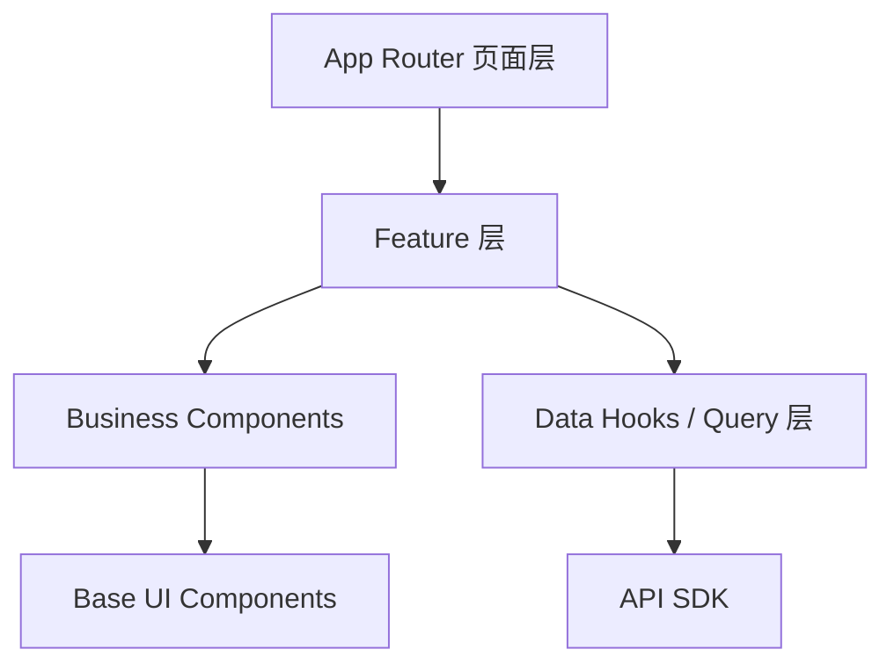

### 页面层

- `search`
- `stocks/[symbol]`
- `documents/[id]`
- `watchlist`
- `alerts`

### Feature 层

- stock-workspace
- document-reader
- watchlist
- alerts-center
- search-entry

### 业务组件层

- 个股摘要条
- 证据时间线
- 风险卡
- thesis 卡
- 提醒列表
- 文档摘要卡

### 基础 UI 层

- shadcn/ui + Radix UI
- Layout
- Drawer
- Tabs
- Popover
- Dialog

## 9.2 前端渲染策略

- 首屏事实数据：`SSR / RSC`
- 高频交互区：`CSR`
- 图表容器：`Client Component`
- 提醒流：`SSE` 优先，必要时 `WebSocket`

## 9.3 图表与组件选型

截至 `2026-04-08`，没有一个成熟高星的“整套股票业务组件库”可直接满足专业投研产品需求。  
推荐采用：

- 通用 UI：`Tailwind CSS + shadcn/ui + Radix UI`
- 表格：`AG Grid`
- 主金融图表：`lightweight-charts`
- A 股 K 线备选：`KLineChart`
- 股票业务组件：`自研`

### 选择理由

`AG Grid`

- 社区成熟
- 专业表格能力强
- 适合自选池、候选池、事件表、财务对比表

`lightweight-charts`

- 金融图表成熟
- 性能好
- 插件扩展能力较好
- 适合 K 线、分时、成交量、多序列

`KLineChart`

- 对 K 线和技术指标支持友好
- 中文生态更直接
- 适合作为 A 股图表体验 PoC

### 明确不建议

- 不依赖所谓“一整套股票 UI 组件库”
- 不把 TradingView widgets 当作核心图表架构
- 不让第三方黑盒图表决定我们的交互能力

## 10. 后端模块设计

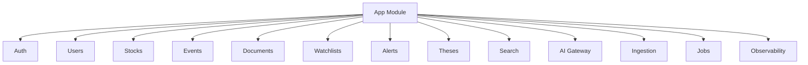

### 推荐分层

- `Controller`
- `Application Service`
- `Domain`
- `Infrastructure`

### 推荐 API 风格

`REST`

- 个股页聚合数据
- 文档详情
- 自选 CRUD
- 提醒 CRUD
- thesis CRUD

`SSE / WebSocket`

- 提醒流
- 长任务状态
- 盘中异动推送

## 11. 数据域与核心对象

## 11.1 领域分层

### L1：证券与市场基础层

- `Stock`
- `TradingDayBar`
- `DailyMetric`
- `FinancialMetric`
- `Industry`

### L2：事件与文档层

- `Event`
- `Document`
- `DocumentChunk`
- `Evidence`

### L3：AI 派生层

- `AiSummary`
- `AiAttribution`
- `AiRiskExtraction`

### L4：用户工作空间层

- `User`
- `Watchlist`
- `WatchlistItem`
- `AlertRule`
- `AlertEvent`
- `Thesis`

## 11.2 数据关系图

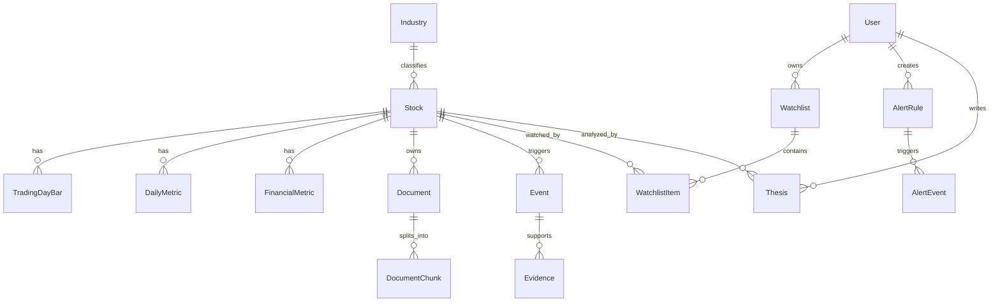

## 11.3 核心建模原则

- `Stock` 是主对象，但不是唯一对象
- `Event` 负责统一“发生了什么变化”
- `Document` 是原始事实载体
- `Evidence` 是 AI 可追溯性的核心对象
- `AiSummary / AiAttribution / AiRiskExtraction` 属于派生数据
- `Watchlist / Alert / Thesis` 属于用户工作空间资产

## 12. 存储架构

## 12.1 PostgreSQL

存储：

- 用户
- 股票主数据
- 事件元数据
- 财务与指标汇总
- 自选 / 提醒 / thesis
- AI 结果索引与缓存元数据

## 12.2 OpenSearch

存储：

- 公告全文索引
- 新闻全文索引
- 问答全文索引
- 文档标签索引
- 混合检索索引

## 12.3 pgvector

存储：

- 文档切片向量
- 事件摘要向量
- thesis 向量

## 12.4 对象存储

存储：

- PDF
- HTML
- 原始文档
- 文档快照

## 12.5 Redis

存储：

- 查询缓存
- 会话
- 队列
- 长任务状态

## 12.6 ClickHouse

中期引入，存储：

- 高频行情与异动流
- 雷达榜单计算结果
- 提醒扫描中间结果

## 12.7 数据源分层策略

### L1 必接

- 行情与日线指标
- 财务报表与财务指标
- 公司公告
- 投资者互动问答
- 基础新闻

### L2 建议尽快补齐

- 券商研报
- 机构调研
- 北向 / 两融 / 大宗等资金数据
- 概念与主题映射

### L3 中长期增强

- 电话会与纪要
- 行业数据库
- 国际市场数据
- 其他高质量替代数据

## 13. 数据接入与标准化流程

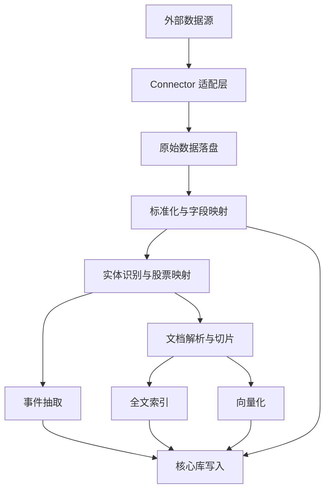

### 说明

1. 所有数据源先经过 `Connector` 抽象
2. 原始文件必须保留，不能只保留解析结果
3. 标准化后必须统一证券主键
4. 事件抽取和文档切片是两条并行流程
5. AI 只消费标准化后的对象，不直接消费原始混乱数据

## 14. 文档处理流程

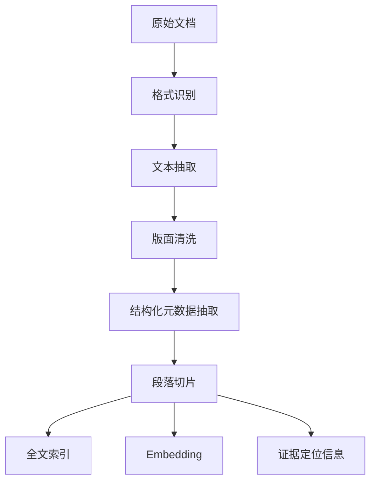

### 关键要求

- 保留页码 / 段落偏移
- 支持原文回跳
- 对公告、财报、问答、新闻统一文档接口

## 15. AI 编排架构

## 15.1 为什么 LangGraph 独立服务

LangGraph 更适合：

- 状态化流程
- 多步骤检索
- 带重试与回退的推理链
- 可插拔 node 设计

NestJS 更适合：

- 权限
- API
- 聚合
- 任务调度

因此推荐：

- `NestJS = 业务后端`
- `Python + LangGraph = AI 编排后端`

## 15.2 AI 流程图

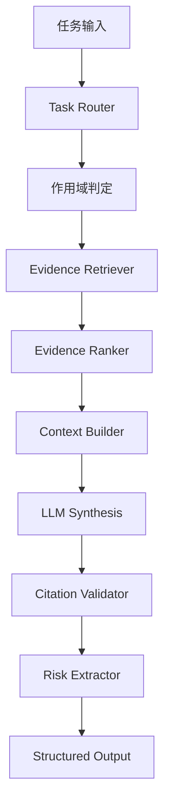

### 关键节点职责

- `Task Router`
  - 判断是个股摘要、文档问答、归因还是候选解释
- `Scope Resolver`
  - 限定股票 / 文档 / 自选范围
- `Evidence Retriever`
  - 从 PostgreSQL / OpenSearch / 向量库召回证据
- `Evidence Ranker`
  - 按权威性、时效性、相关性排序
- `Context Builder`
  - 组装结构化上下文
- `Citation Validator`
  - 校验每条结论是否有有效引用
- `Risk Extractor`
  - 补充反证与风险

## 15.3 AI 输出契约

所有关键 AI 结果统一输出：

- `summary`
- `bullets`
- `citations[]`
- `risks[]`
- `time_range`
- `confidence`

## 16. 核心业务流

### 16.0 页面与服务映射图

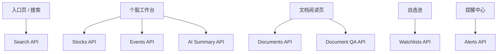

## 16.1 个股工作台加载链路

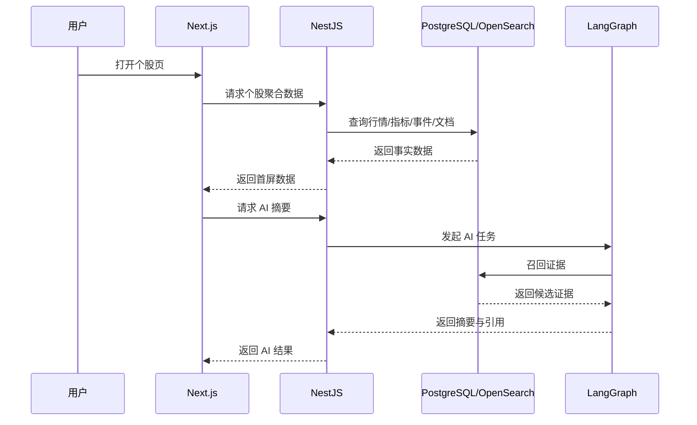

### 关键要求

- 先返回事实数据，再返回 AI
- 首屏不要被 AI 阻塞

## 16.2 文档问答链路

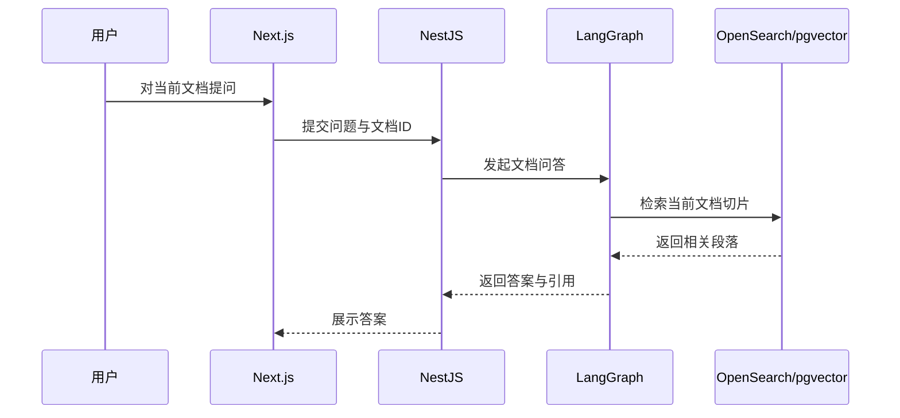

### 关键要求

- 默认仅限当前文档作用域
- 回答必须能回跳到原文段落

## 16.3 提醒计算链路

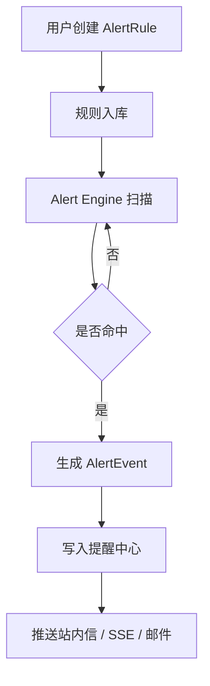

### 关键要求

- 提醒必须服务端执行
- 提醒事件必须绑定股票 / 事件 / 文档其一

## 16.4 中期候选池生成链路

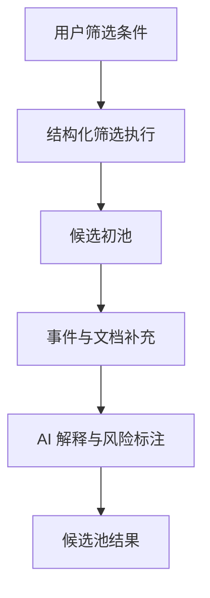

### 关键要求

- 候选池的第一步应是结构化筛选，不是直接 LLM 生成
- AI 负责解释和补充，不负责凭空“找票”

## 17. 推荐 API 聚合设计

### 17.1 个股工作台

- `GET /stocks/:symbol/workspace`
- `GET /stocks/:symbol/events`
- `GET /stocks/:symbol/metrics`
- `GET /stocks/:symbol/peers`
- `GET /stocks/:symbol/ai-summary`

### 17.2 文档

- `GET /documents/:id`
- `POST /documents/:id/qa`
- `GET /documents/:id/summary`

### 17.3 自选

- `GET /watchlists`
- `POST /watchlists`
- `POST /watchlists/:id/items`

### 17.4 提醒

- `GET /alerts`
- `POST /alerts`
- `PATCH /alerts/:id`

### 17.5 thesis

- `GET /theses`
- `POST /theses`
- `PATCH /theses/:id`

## 18. 非功能要求

## 18.1 性能目标

- 个股页首屏事实数据：`P95 <= 3s`
- 已缓存 AI 摘要：`P95 <= 1s`
- 新 AI 任务返回：`P95 <= 10s`
- 文档详情打开：`P95 <= 2s`

## 18.2 数据新鲜度目标

- 日线 / 基础指标：T+0 或 T+1 按源可配置
- 公告 / 问答 / 新闻：增量拉取 + 失败重试
- AI 派生结果：支持失效和重算

## 18.3 可观测性

必须监控：

- API 响应时间
- AI 任务耗时
- 检索召回量
- 引用校验失败率
- 提醒命中率
- 数据采集失败率
- 队列积压

## 18.4 安全与合规

- JWT
- 数据源密钥隔离
- 用户工作空间隔离
- 审计日志
- 文档访问控制
- AI 调用限流

## 19. 部署建议

## 19.1 MVP 部署拓扑

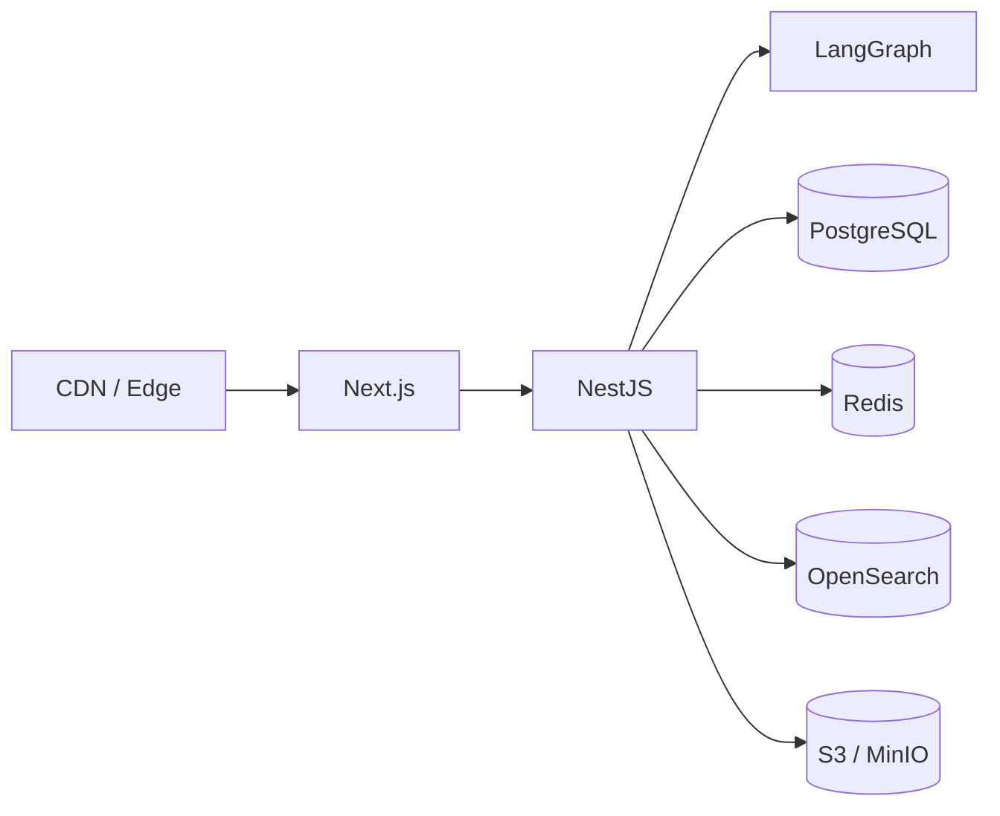

### MVP 原则

- 业务后端与 AI 服务分开部署
- 先用模块化单体，不急于微服务
- 数据采集 Worker 可独立部署
- 不引入多租户和共享协作权限系统

## 19.2 中期扩展

- 引入 ClickHouse
- 拆分 Search Service
- 拆分 Alert Engine
- 拆分 Ingestion Worker
- 使用 Kubernetes 做弹性扩容

## 20. 架构结论

当前阶段最稳妥的落点是：

1. `Next.js + Tailwind CSS` 负责专业桌面工作台体验
2. `NestJS` 负责核心业务 API 与聚合
3. `Python + LangGraph` 负责 AI 编排与证据化生成
4. `PostgreSQL + Redis + OpenSearch + 对象存储` 组成 MVP 数据底座
5. `ClickHouse` 作为中期的时序和雷达计算增强层

这套架构能支撑：

- V1 的单票研究闭环
- V2 的市场雷达与候选池
- V3 的个人自动化、研究记忆与更深数据覆盖

## 21. 参考资料

### 行业产品

- Bloomberg Terminal： https://professional.bloomberg.com/products/bloomberg-terminal/
- AlphaSense： https://www.alpha-sense.com/solutions/financial-services
- Koyfin Screener： https://www.koyfin.com/features/stock-screener/
- Koyfin Alerts： https://www.koyfin.com/features/alerts/
- TradingView Screener： https://www.tradingview.com/support/solutions/43000718866-what-is-the-stock-screener/
- TradingView Alerts： https://www.tradingview.com/support/solutions/43000520149-introduction-to-tradingview-alerts/
- Quartr API： https://quartr.com/products/quartr-api
- Wind WFT： https://www.wind.com.cn/portal/en/WFT/index.html
- iFinD： https://aifind.com/
- ChoiceAI： https://choice.eastmoney.com/school

### 组件与图表

- lightweight-charts： https://github.com/tradingview/lightweight-charts
- AG Grid： https://github.com/ag-grid/ag-grid
- KLineChart： https://github.com/klinecharts/KLineChart
- React Financial Charts： https://github.com/react-financial/react-financial-charts
