# Alpha Sight 技术架构设计

## 1. 文档信息

- 项目：`Alpha Sight`
- 文档类型：`技术架构设计`
- 版本：`v0.3`
- 更新时间：`2026-04-09`

## 2. 技术目标

技术方案必须服务以下产品目标：

1. `个股工作台首屏快`
2. `AI 输出必须可追溯`
3. `文档和事件可持续增量接入`
4. `提醒必须服务端稳定触发`
5. `系统可从 MVP 平滑扩展到市场雷达与候选池`
6. `系统默认只服务个人工作空间，不为协作而预埋复杂度`

这意味着架构不能只围绕“页面渲染”设计，而必须同时考虑：

- 数据接入与标准化
- 文档解析与检索
- 事件建模
- AI 证据化生成
- 用户工作空间
- 服务端提醒引擎

## 3. 技术栈结论

### 3.1 前端

- 框架：`Next.js`（App Router）
- 语言：`TypeScript`
- 样式：`Tailwind CSS`
- 通用组件：`shadcn/ui + Radix UI`
- 表单与运行时校验：`React Hook Form + Zod`
- 远程数据：`TanStack Query`（仅用于客户端交互区）
- 表格：`TanStack Table`（V1）
- 图表：`lightweight-charts`
- 图标：`Lucide`

### 3.2 后端

- 框架：`NestJS`
- 语言：`TypeScript`
- ORM：`Drizzle ORM`
- Migration：`drizzle-kit`
- DTO / 配置校验：`Zod + nestjs-zod`
- API 风格：`REST + SSE`
- 调度与异步任务：`BullMQ + Redis`
- 日志：`Pino`
- 鉴权：`JWT`

### 3.3 AI 侧

- 运行时：`Node.js`
- 语言：`TypeScript`
- 编排方式：`自研 AI Pipeline`（不引入 LangGraph）
- 代码形态：`Monorepo 内共享包 packages/ai-core`
- LLM 调用：`Vercel AI SDK + Provider Adapter`
- 结构化输出：`Zod`
- Embedding / Retrieval：统一检索与向量化抽象

### 3.4 数据层

- 主数据库：`PostgreSQL`
- 向量检索：`pgvector`
- 缓存 / 队列：`Redis`
- 全文检索：`OpenSearch`（按需求引入，不作为 V1 硬前置）
- 对象存储：`S3 / MinIO`
- 本地开发编排：`Docker Compose`

### 3.5 工程组织

- 代码仓：`Monorepo`
- JS 包管理：`pnpm workspace`
- 任务编排：`Turborepo`
- 测试：`Vitest + Supertest + Playwright`
- 共享契约：`packages/contracts`
- 数据访问层：`packages/db`
- AI 复用层：`packages/ai-core`

### 3.6 当前阶段技术取舍

`当前有必要`

- `Next.js App Router`：保证个股页和文档页首屏事实数据快
- `NestJS + Drizzle + Zod`：保证 API 聚合、数据建模和运行时校验都清晰可控
- `PostgreSQL + pgvector + Redis + S3/MinIO`：支撑事实数据、检索、任务队列和原始文档保留
- `BullMQ`：承接采集、解析、embedding、AI 生成、提醒扫描等异步链路
- `Node.js / TypeScript` 统一 AI Pipeline：降低跨语言和跨服务复杂度
- `SSE`：足够覆盖提醒流和长任务状态回传

`按需求引入`

- `TanStack Query`：只用于客户端交互区，不接管首屏 RSC 数据
- `OpenSearch`：当跨文档全文检索、中文搜索召回不足时再引入
- `AG Grid`：只在中期批量覆盖和复杂表格场景引入

`当前暂不必要`

- `Python + LangGraph`
- `独立 AI Orchestrator 服务`
- `WebSocket`
- `ClickHouse`
- `Kubernetes`
- `重型可观测性栈`

## 4. 行业对标对架构的影响

技术方案不是凭空选出来的，它必须反映产品对标后的结论。

### 4.1 从 Bloomberg 学到的

- 页面只是表现层，真正价值在统一研究工作流
- 因此需要 `业务 API 聚合层`，而不是前端直接拼多个底层数据源

### 4.2 从 AlphaSense 学到的

- AI 必须基于优质内容池和引用校验
- 因此需要 `检索层 + 证据层 + 引用校验层`

### 4.3 从 Koyfin / TradingView 学到的

- Alerts 不是页面功能，而是服务端能力
- 因此提醒要单独做 `规则存储 + 服务端计算 + 投递`

### 4.4 从 Quartr 学到的

- 文档不是附件，而是研究主对象
- 因此需要 `文档解析、切片、索引、引用定位`

### 4.5 从 Wind / iFinD / ChoiceAI 学到的

- A 股产品必须优先处理本土数据源和事件体系
- 因此需要 `数据源适配层 + 实体标准化 + 事件抽取`

## 5. 总体架构原则

1. `业务 API 与 AI Pipeline 解耦`
2. `先模块化单体，后按职责拆分`
3. `先事实数据，后 AI 派生数据`
4. `先事件与证据建模，后做复杂分析`
5. `先统一 TypeScript / Node 语言栈，减少跨服务摩擦`
6. `先共享包复用，后独立服务拆分`
7. `所有关键链路至少具备最小可观测性`
8. `优先支持个人工作空间，不提前引入协作复杂度`

## 6. 系统上下文图

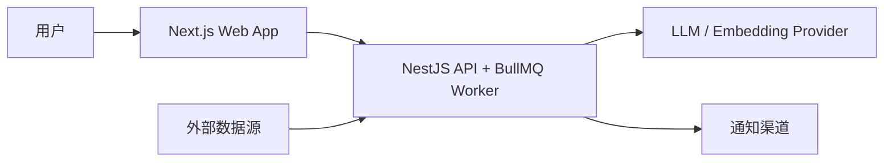

## 7. 容器级架构图

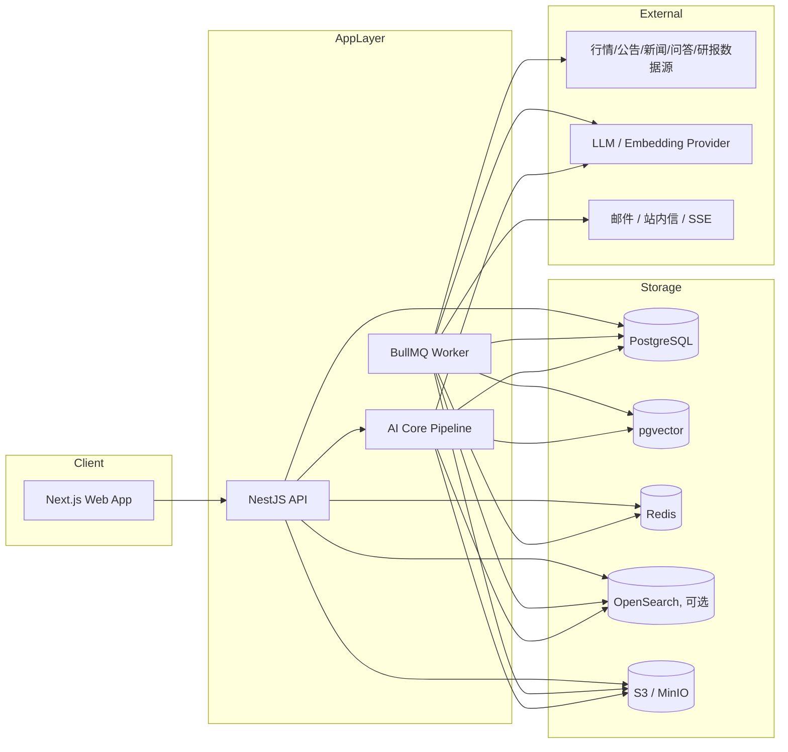

### 7.1 在线读路径与离线写路径

这张图用来明确系统最核心的两条主链路：

- `离线写路径`：把外部数据变成可服务的研究对象
- `在线读路径`：把事实数据和 AI 结果组合后返回给用户

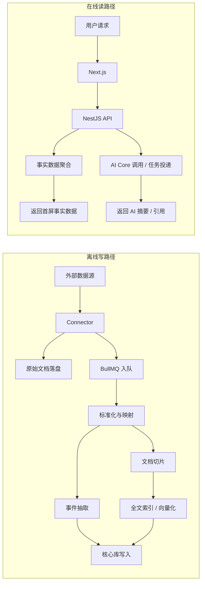

## 8. 服务职责划分

## 8.1 Next.js Web App

职责：

- 页面路由与布局
- SSR / RSC 首屏渲染
- 客户端交互状态
- 表格、图表、证据卡片等渲染
- SSE 接收提醒与长任务状态

不负责：

- 直接访问底层数据源
- 直接调用模型和向量库

## 8.2 NestJS API

职责：

- 统一业务 API
- 用户与基础鉴权
- 聚合个股页 / 自选 / 提醒等页面数据
- 管理异步任务
- 调用 `AI Core`
- 审计与操作日志

不负责：

- 复杂 AI 工作流编排框架
- 大规模文档切片和向量化

## 8.3 BullMQ Worker

职责：

- 采集外部数据
- 做标准化、清洗、入库
- 文档解析与索引
- 事件抽取
- embedding 生成
- AI 摘要预计算 / 重算
- 提醒规则扫描
- 通知投递重试

## 8.4 提醒与定时任务

职责：

- 管理提醒规则的异步执行
- 周期或事件驱动执行规则计算
- 生成 `AlertEvent`
- 投递到站内信 / SSE / 邮件

说明：

- 当前阶段这是 `BullMQ Worker` 中的一组任务处理器，不单独拆服务
- 只有当提醒规则量、扫描频率和投递渠道明显膨胀时，再考虑独立拆分

## 8.5 AI Core Pipeline（Node / TypeScript）

职责：

- 个股摘要
- 归因生成
- 文档摘要
- 文档问答
- 风险提取
- 候选池解释
- 日报 / 周报生成

说明：

- 当前阶段不单独部署 AI 服务
- `apps/api` 负责在线低延迟 AI 请求
- `apps/worker` 负责离线预生成和重算
- 两者通过 `packages/ai-core` 共享同一套检索、Prompt 和结构化输出逻辑

## 9. 前端架构

## 9.1 前端模块分层

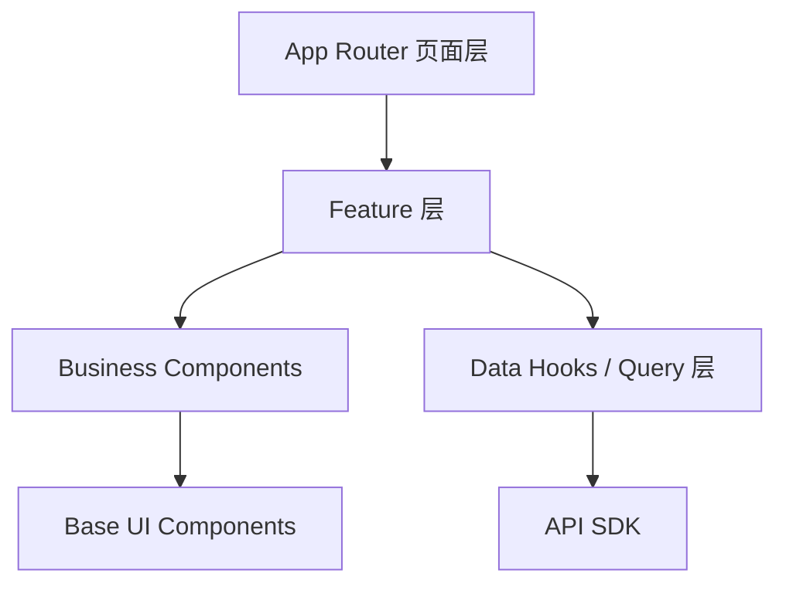

### 页面层

- `search`
- `stocks/[symbol]`
- `documents/[id]`
- `watchlists/[id]`
- `alerts`
- `themes/[id]`（P1）

### Feature 层

- stock-workspace
- document-reader
- watchlist-intelligence
- alerts-center
- search-entry
- thesis-panel
- theme-chain

### 业务组件层

- 个股摘要条
- 证据时间线
- 归因候选卡
- 风险卡
- thesis 卡
- 自选优先级卡
- 提醒列表
- 文档摘要卡

### 基础 UI 层

- shadcn/ui + Radix UI
- Layout
- Drawer
- Tabs
- Popover
- Dialog

## 9.2 前端渲染策略

- 首屏事实数据：`SSR / RSC`
- 高频交互区：`CSR`
- 图表容器：`Client Component`
- 提醒流：`SSE`

### TanStack Query 使用边界

- 用于客户端远程状态：自选增删改、提醒状态变更、thesis 保存、列表刷新、长任务状态补拉
- 不用于首屏事实数据首取：个股页和文档页首屏仍以 `RSC / SSR` 为主
- 不用于纯 UI 状态：筛选弹窗开关、局部面板展开收起优先使用 URL state 或 local state
- SSE 到来的增量事件优先写入 Query Cache，而不是再维护一套平行状态树

### 客户端状态原则

- `local state` 优先于全局状态
- `URL state` 优先承接筛选、排序、作用域切换
- 当前阶段不引入 `Zustand`

## 9.3 图表与组件选型

截至 `2026-04-09`，没有一个成熟高星的“整套股票业务组件库”可直接满足专业投研产品需求。  
推荐采用：

- 通用 UI：`Tailwind CSS + shadcn/ui + Radix UI`
- 表格：`TanStack Table`
- 主金融图表：`lightweight-charts`
- 股票业务组件：`自研`

### 选择理由

`TanStack Table`

- 轻量
- 类型系统友好
- 更适合 V1 阶段快速搭出自选池、提醒中心、事件表和对比表
- 等复杂冻结列、分组透视、批量编辑成为真实瓶颈后，再考虑 `AG Grid`

`lightweight-charts`

- 金融图表成熟
- 性能好
- 插件扩展能力较好
- 适合 K 线、分时、成交量、多序列

### 明确不建议

- 不依赖所谓“一整套股票 UI 组件库”
- 不把 TradingView widgets 当作核心图表架构
- 不让第三方黑盒图表决定我们的交互能力
- 不在 V1 为了“专业感”过早引入重量级表格生态

## 10. 后端模块设计

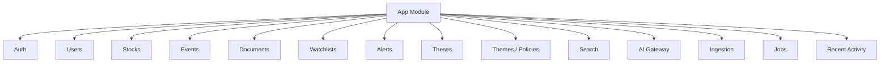

### 推荐分层

- `Controller`
- `Application Service`
- `Domain`
- `Infrastructure`

### 推荐包划分

- `apps/api`：NestJS API、聚合接口、SSE
- `apps/worker`：BullMQ Processors
- `packages/contracts`：共享 `Zod Schema`、API DTO、AI 输出契约
- `packages/db`：`Drizzle Schema`、查询封装、migration
- `packages/ai-core`：检索、Prompt、结构化输出、引用校验
- `packages/ui`：可复用业务组件和基础 UI 封装

### 推荐 API 风格

`REST`

- 搜索
- 个股页聚合数据
- 文档详情
- 自选 CRUD
- 提醒 CRUD
- thesis CRUD
- 主题 / 政策查询
- 最近访问与最近研究对象

`SSE`

- 提醒流
- 长任务状态
- AI 任务完成通知

## 11. 数据域与核心对象

## 11.1 领域分层

### L1：证券与市场基础层

- `Stock`
- `StockAlias`
- `TradingDayBar`
- `DailyMetric`
- `FinancialMetric`
- `Industry`
- `ConceptTheme`

### L2：事件与文档层

- `Event`
- `Document`
- `DocumentChunk`
- `Evidence`
- `PolicyDocument`
- `EventDocumentLink`

### L3：研究上下文层

- `Theme`
- `ThemeStockLink`
- `PeerRelation`
- `Catalyst`
- `ThemeTimelineEdge`

### L4：AI 派生层

- `AiSummary`
- `AiAttributionCandidate`
- `AiRiskExtraction`

### L5：用户工作空间层

- `User`
- `Watchlist`
- `WatchlistItem`
- `WatchlistPrioritySnapshot`
- `AlertRule`
- `AlertEvent`
- `AlertDelivery`
- `Thesis`
- `ThesisVersion`
- `ThesisStateTransition`
- `RecentVisit`

## 11.2 数据关系图

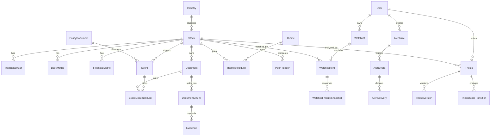

## 11.3 核心建模原则

- `Stock` 是主对象，但不是唯一对象
- `Event` 负责统一“发生了什么变化”
- `Document` 是原始事实载体
- `Evidence` 是 AI 可追溯性的核心对象
- `Theme / Policy / PeerRelation / Catalyst` 负责补足“这只票所处的外部上下文”
- `AiSummary / AiAttributionCandidate / AiRiskExtraction` 属于派生数据
- `Watchlist / Alert / Thesis / RecentVisit` 属于用户工作空间资产
- `ThesisVersion` 和 `WatchlistPrioritySnapshot` 不是附属表，而是研究过程可回看性的必要对象

## 12. 存储架构

## 12.1 PostgreSQL

存储：

- 用户
- 股票主数据
- 事件元数据
- 财务与指标汇总
- 主题 / 政策 / 同行 / 催化剂关系
- 自选 / 提醒 / thesis / 最近访问
- thesis 版本历史与状态迁移
- 自选优先级快照
- AI 结果索引与缓存元数据

## 12.2 OpenSearch

定位：

- `可选增强层`，不是当前版本硬依赖
- 当跨文档全文搜索、中文召回质量、搜索联想明显不够时引入

存储：

- 公告全文索引
- 新闻全文索引
- 问答全文索引
- 政策 / 产业文档索引
- 文档标签索引
- 混合检索索引

## 12.3 pgvector

存储：

- 文档切片向量
- 事件摘要向量
- thesis 向量
- 主题 / 政策说明向量

## 12.4 对象存储

存储：

- PDF
- HTML
- 原始文档
- 文档快照
- 清洗后中间产物

## 12.5 Redis

存储：

- 查询缓存
- 会话
- 队列
- 长任务状态
- SSE 推送辅助状态

## 12.6 ClickHouse

当前阶段不引入。

只有在以下条件同时成立时再考虑：

- 盘中高频异动与扫描计算明显压垮 PostgreSQL
- 市场雷达、排行榜和批量筛选成为主要流量入口
- 提醒扫描从分钟级扩大到更高频率

在那之前，优先用 `PostgreSQL + 预聚合表 + 定时任务` 解决。

## 12.7 数据源分层策略

### L1 必接

- 行情与日线指标
- 财务报表与财务指标
- 公司公告
- 投资者互动问答
- 基础新闻
- 行业分类
- 基础资金面信号
- 主题 / 概念基础映射

### L2 建议尽快补齐

- 政策与产业文档
- 券商研报
- 机构调研
- 北向 / 两融 / 大宗等资金数据
- 同行与产业链关系映射
- 催化剂日历基础数据

### L3 中长期增强

- 电话会与纪要
- 行业数据库
- 国际市场数据
- 其他高质量替代数据

## 13. 数据接入与标准化流程

```mermaid
flowchart TD
    A[外部数据源]
    B[Connector 适配层]
    C[原始数据写入对象存储]
    D[BullMQ 入队]
    E[标准化与字段映射]
    F[实体识别与股票映射]
    G[事件抽取]
    H[文档解析与切片]
    I[全文索引(Optional)]
    J[向量化]
    K[核心库写入]

    A --> B
    B --> C
    B --> D
    D --> E
    E --> F
    F --> G
    F --> H
    H --> I
    H --> J
    E --> K
    G --> K
    I --> K
    J --> K
```

### 说明

1. 所有数据源先经过 `Connector` 抽象
2. 原始文件必须保留，不能只保留解析结果
3. 标准化后必须统一证券主键
4. `BullMQ` 负责把采集、解析、embedding、索引写入拆成可重试任务
5. 事件抽取和文档切片是两条并行流程
6. `packages/db` 中的 `Drizzle Schema` 是标准化后的唯一写入入口
7. AI 只消费标准化后的对象，不直接消费原始混乱数据

### 任务队列建议

- `ingest-source`：采集与标准化
- `parse-document`：文档解析与切片
- `index-document`：全文索引写入
- `embed-chunks`：向量化
- `generate-ai-summary`：个股 / 文档摘要
- `scan-alert-rules`：提醒扫描
- `deliver-alert`：提醒投递
- `rebuild-read-model`：预聚合读模型刷新

## 14. 文档处理流程

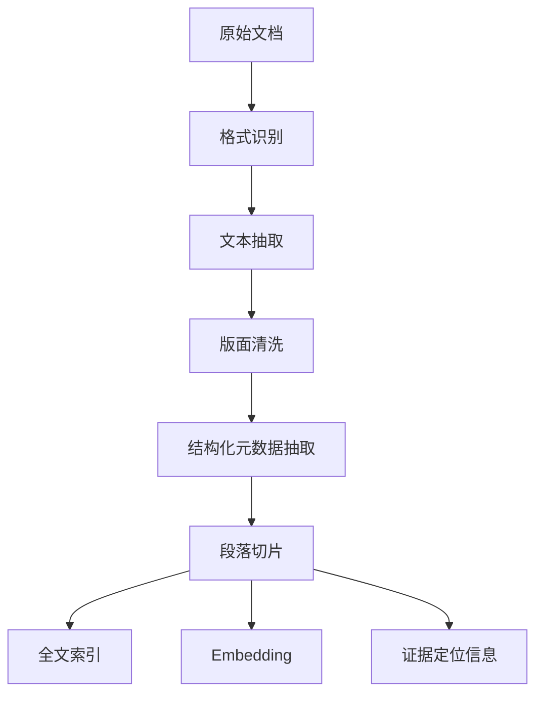

### 关键要求

- 保留页码 / 段落偏移
- 支持原文回跳
- 对公告、财报、问答、新闻统一文档接口

### Node 技术实现建议

- PDF 文本抽取：`pdfjs-dist`
- HTML 解析与清洗：`cheerio + 自研清洗规则`
- Markdown / 纯文本归一：`unified` 体系可选
- Chunk 策略：`段落优先 + token 上限兜底`
- 引用锚点：`page_no + chunk_index + char_start + char_end`

### 当前阶段明确不做

- 不把 OCR 作为 V1 硬依赖
- 如果遇到扫描版 PDF，先记录为低质量文档并允许后补处理
- 只有当扫描文档占比高到影响主路径时，再引入 OCR 能力

## 15. AI 编排架构

## 15.1 为什么当前阶段不拆独立 AI 服务

当前阶段的 AI 任务本质上还是：

- 检索
- 过滤
- 拼上下文
- 结构化输出
- 引用校验
- 风险 / 反证补充

它们还没有复杂到必须上图编排框架，更没有复杂到必须用独立语言栈和独立服务来承载。

当前方案更务实：

- `apps/api` 负责在线低延迟调用
- `apps/worker` 负责预生成、重算和批量任务
- `packages/ai-core` 复用检索、Prompt、Schema、引用校验逻辑
- `BullMQ` 负责耗时任务的异步化、重试和状态跟踪

只有在 AI 工作流明显出现以下特征时，才考虑独立服务化：

- 多阶段 agent 工具调用明显增多
- 状态机分支、人工回退、长链路恢复明显复杂
- AI 流量和在线 API 流量隔离诉求很强

## 15.2 AI 流程图

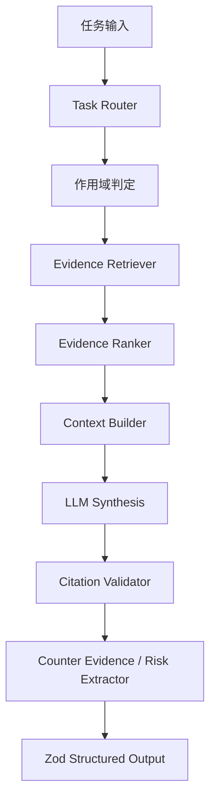

### 关键节点职责

- `Task Router`
  - 判断是个股摘要、文档问答、归因、风险提取还是候选解释
- `Scope Resolver`
  - 限定股票 / 文档 / 自选 / 主题 / 时间范围
- `Evidence Retriever`
  - 先做元数据过滤，再从 `PostgreSQL + pgvector + Optional OpenSearch` 召回证据
- `Evidence Ranker`
  - V1 以规则加权排序为主：来源权威性、时效性、相关性、是否一手资料
- `Context Builder`
  - 组装事实区、候选驱动区、反证区、时间范围
- `LLM Synthesis`
  - 使用 `Vercel AI SDK` 调用模型并输出结构化结果
- `Citation Validator`
  - 校验每条结论是否有有效引用
- `Counter Evidence / Risk Extractor`
  - 强制补充反证、风险与不确定性
- `Zod Structured Output`
  - 最终输出必须过 `Zod` 解析，不接受自由文本裸输出

## 15.3 AI 输出契约

所有关键 AI 结果统一输出：

- `summary`
- `bullets[]`
- `attribution_candidates[]`
- `citations[]`
- `risks[]`
- `counter_evidence[]`
- `time_range`
- `fact_vs_inference`
- `uncertainty_note`
- `confidence`

### 关键约束

- “今天为什么动了”默认输出 `1 到 3` 条候选驱动因素
- 每条候选驱动因素都必须标注类型：`个股 / 行业主题 / 政策监管 / 市场共振`
- 结论必须区分 `事实` 与 `推断`
- 证据不足时必须明确返回“证据不足，暂不下结论”
- `confidence` 只能表达证据完备度与模型把握度，不能表达投资胜率

## 16. 核心业务流

### 16.0 页面与服务映射图

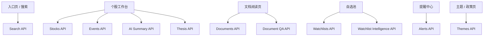

## 16.1 个股工作台加载链路

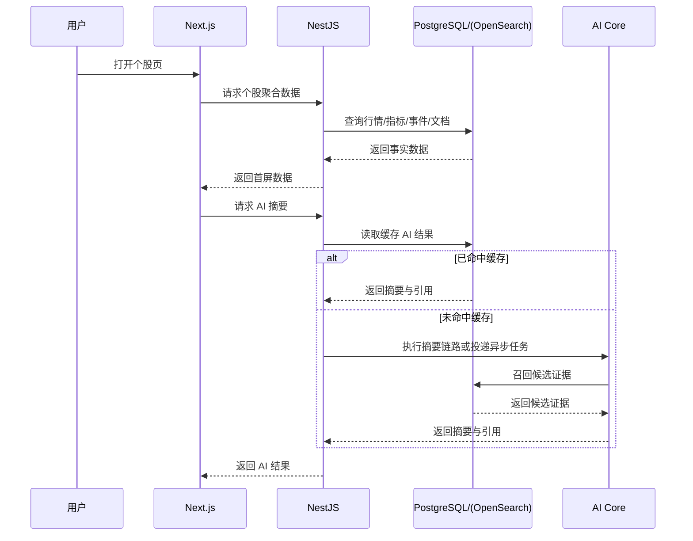

### 关键要求

- 先返回事实数据，再返回 AI
- 首屏不要被 AI 阻塞

## 16.2 文档问答链路

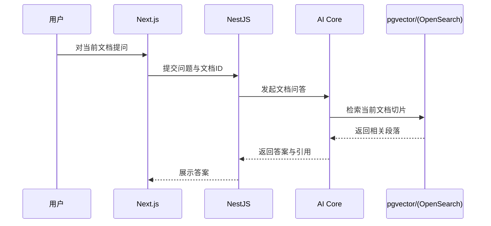

### 关键要求

- 默认仅限当前文档作用域
- 回答必须能回跳到原文段落

## 16.3 提醒计算链路

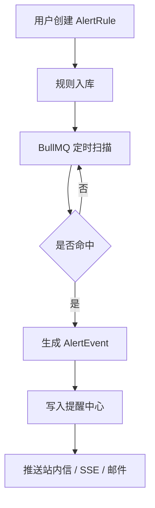

### 关键要求

- 提醒必须服务端执行
- 提醒事件必须绑定股票 / 事件 / 文档 / thesis 中的至少一类对象
- 提醒规则必须支持冷却期、去重和失败重试

## 16.4 中期候选池生成链路

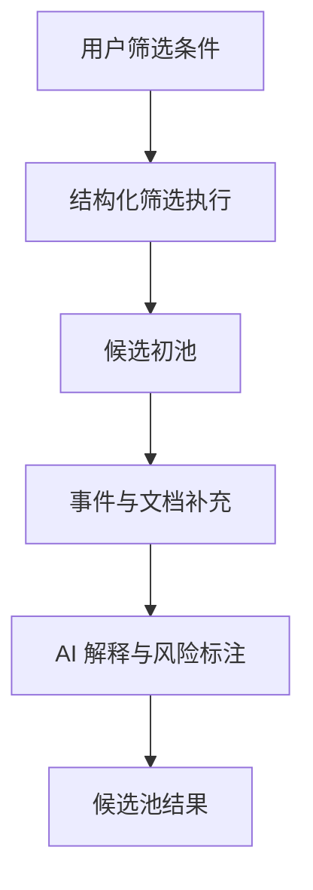

### 关键要求

- 候选池的第一步应是结构化筛选，不是直接 LLM 生成
- AI 负责解释和补充，不负责凭空“找票”

## 17. 推荐 API 聚合设计

### 17.1 搜索与入口

- `GET /search/suggest?q=`
- `GET /search?q=`
- `GET /research/recent`
- `GET /alerts/unread`

### 17.2 个股工作台

- `GET /stocks/:symbol/workspace`
- `GET /stocks/:symbol/events`
- `GET /stocks/:symbol/metrics`
- `GET /stocks/:symbol/peers`
- `GET /stocks/:symbol/themes`
- `GET /stocks/:symbol/ai-summary`

### 17.3 文档

- `GET /documents/:id`
- `POST /documents/:id/qa`
- `GET /documents/:id/summary`

### 17.4 自选

- `GET /watchlists`
- `POST /watchlists`
- `POST /watchlists/:id/items`
- `PATCH /watchlists/:id/items/:itemId`
- `GET /watchlists/:id/intelligence`

### 17.5 提醒

- `GET /alerts`
- `POST /alerts`
- `PATCH /alerts/:id`

### 17.6 thesis

- `GET /theses`
- `POST /theses`
- `PATCH /theses/:id`
- `GET /theses/:id/history`

### 17.7 主题 / 政策

- `GET /themes/:id`
- `GET /themes/:id/stocks`
- `GET /themes/:id/events`
- `GET /policies/:id`

## 18. 非功能要求

## 18.1 性能目标

- 个股页首屏事实数据：`P95 <= 3s`
- 全局搜索联想：`P95 <= 1s`
- 已缓存 AI 摘要：`P95 <= 1s`
- 新 AI 任务返回：`P95 <= 10s`
- 文档详情打开：`P95 <= 2s`

## 18.2 数据新鲜度目标

- 日线 / 基础指标：T+0 或 T+1 按源可配置
- 公告 / 问答 / 新闻：增量拉取 + 失败重试
- AI 派生结果：支持失效和重算

## 18.3 可观测性

当前阶段只做最小可用观测：

- 结构化日志：`Pino`
- 队列可视化：`BullMQ Dashboard` 或等价能力
- 任务级错误日志：采集失败、解析失败、AI 失败、提醒投递失败

必须监控：

- API 响应时间
- AI 任务耗时
- 检索召回量
- 引用校验失败率
- 提醒命中率
- 数据采集失败率
- 队列积压

## 18.4 安全与合规

- `JWT`
- `Zod` 运行时入参 / 出参校验
- 数据源密钥隔离
- 用户工作空间隔离
- 基础审计日志
- 文档访问控制
- AI 调用限流

当前阶段暂不追求：

- 重型零信任体系
- 复杂 RBAC / ABAC
- 多租户隔离体系

## 18.5 测试策略

- `Vitest`：领域逻辑、工具函数、AI 输出解析、排序规则
- `Supertest`：NestJS API 集成测试
- `Playwright`：搜索入口、个股页、文档问答、自选与提醒主链路
- 队列任务至少覆盖：采集、解析、AI 生成、提醒扫描四类处理器

## 19. 部署建议

## 19.1 MVP 部署拓扑

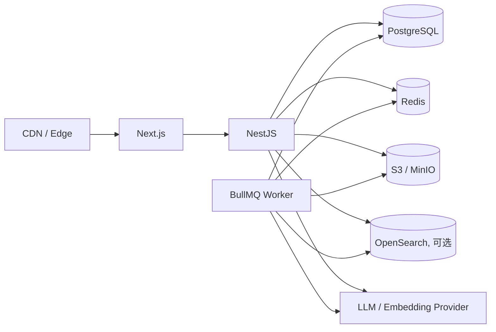

### MVP 原则

- 先用模块化单体，不急于微服务
- AI 逻辑以共享包形式存在，不额外部署独立 AI 服务
- `api` 与 `worker` 可以分开部署，但仍属于同一语言栈、同一代码仓
- `OpenSearch` 不是 MVP 强依赖，可按搜索质量决定是否引入
- 本地开发优先使用 `Docker Compose`
- 不引入多租户和共享协作权限系统

## 19.2 中期扩展

- 当跨文档搜索复杂度上升时，再考虑稳定引入 `OpenSearch`
- 当提醒扫描与投递量上升时，再考虑拆分提醒任务组
- 当批量覆盖、排行榜、雷达成为主路径时，再考虑 `ClickHouse`
- 当流量和团队规模都显著扩大时，再考虑容器编排平台
- `Kubernetes` 不是中期默认前提

## 20. 架构结论

当前阶段最稳妥的落点是：

1. `Next.js + Tailwind CSS + TanStack Query` 负责桌面研究工作台体验
2. `NestJS + Drizzle + Zod` 负责核心业务 API、数据访问和运行时契约
3. `BullMQ + Redis` 负责采集、解析、AI 生成、提醒扫描等异步任务
4. `Node.js / TypeScript AI Core` 负责检索增强、结构化输出、引用校验和风险补充
5. `PostgreSQL + pgvector + S3/MinIO` 构成 MVP 的主数据底座，`OpenSearch` 视搜索质量按需引入

这套架构能支撑：

- V1 的单票研究闭环
- V2 的市场雷达与候选池
- V3 的个人自动化、研究记忆与更深数据覆盖

同时保持了明确取舍：

- 保留当前真正必要的基础设施
- 延后独立 AI 服务、ClickHouse、Kubernetes 等高成本技术决策
- 先把研究闭环做深，再按瓶颈扩展技术复杂度

## 21. 参考资料

### 行业产品

- Bloomberg Terminal： https://professional.bloomberg.com/products/bloomberg-terminal/
- AlphaSense： https://www.alpha-sense.com/solutions/financial-services
- Koyfin Screener： https://www.koyfin.com/features/stock-screener/
- Koyfin Alerts： https://www.koyfin.com/features/alerts/
- TradingView Screener： https://www.tradingview.com/support/solutions/43000718866-what-is-the-stock-screener/
- TradingView Alerts： https://www.tradingview.com/support/solutions/43000520149-introduction-to-tradingview-alerts/
- Quartr API： https://quartr.com/products/quartr-api
- Wind WFT： https://www.wind.com.cn/portal/en/WFT/index.html
- iFinD： https://aifind.com/
- ChoiceAI： https://choice.eastmoney.com/school

### 组件与图表

- Next.js： https://nextjs.org/
- NestJS： https://nestjs.com/
- Drizzle ORM： https://orm.drizzle.team/
- Zod： https://zod.dev/
- BullMQ： https://bullmq.io/
- TanStack Query： https://tanstack.com/query/latest
- TanStack Table： https://tanstack.com/table/latest
- Vercel AI SDK： https://sdk.vercel.ai/
- pdfjs-dist： https://github.com/mozilla/pdf.js
- cheerio： https://github.com/cheeriojs/cheerio
- lightweight-charts： https://github.com/tradingview/lightweight-charts
